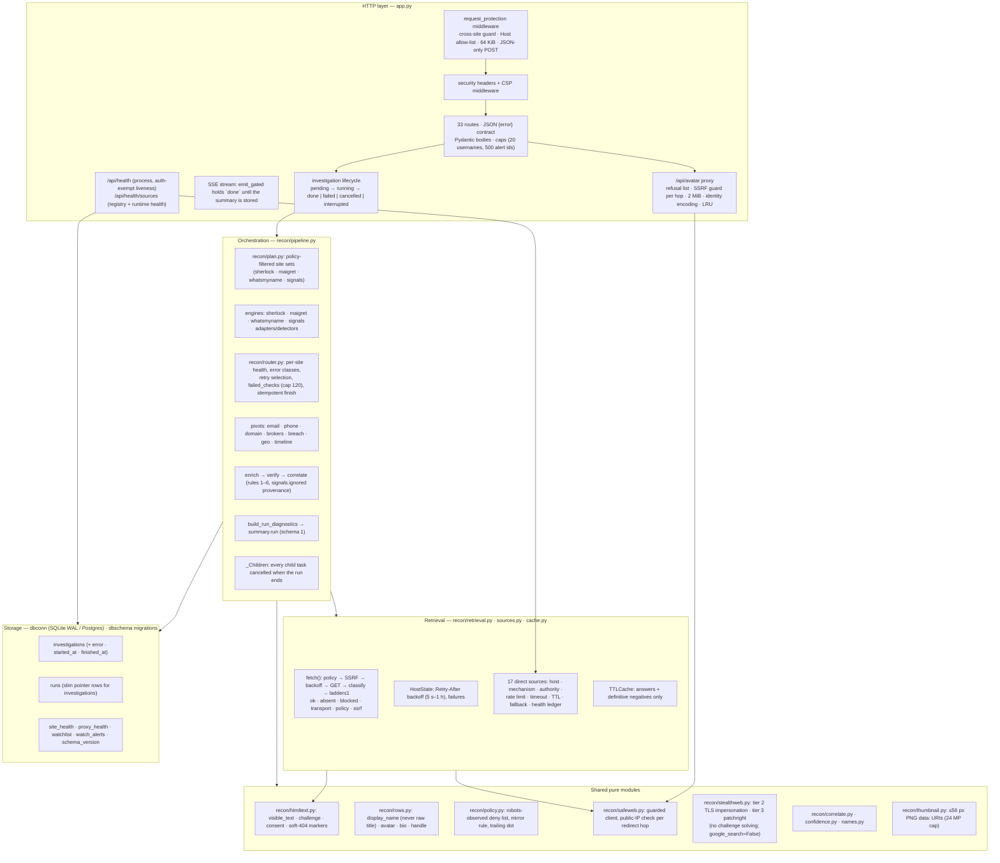

# sherlock-web — architecture as built (2026-09-06, after the engineering program)

This is the *current* architecture: what is on `main` after increments A–I, G1–G2, H1–H3, D3
(lockfile) and the Railway hotfix (see [`08-changelog.md`](08-changelog.md) for each merge and its review).
The starting point is preserved in the audits under `../audit/2026-09-06/`; the intent is in
[`02-target-architecture.md`](02-target-architecture.md). Where the two differ, this file says so
in §8.

Sizes on `main` (`wc -l`): `app.py` 2 153 lines, `recon/` 39 modules / 12 454 lines,
`static/js/app.js` 3 531, `static/css/app.css` 9 117; 44 test files, 887 tests + 1 skipped,
gate ≈ 4 s.

## 1. Component model



**Boundaries as enforced today**

* `app.py` owns HTTP, the SSE plumbing and the state machine. The duplicate v2 scan pipeline
  (`/api/recon/stream`) is gone; `/api/recon/report/{id}` remains for stored `kind="recon"` rows
  and redirects investigation rows to the dossier.
* `recon/pipeline.py` takes `investigation_id`, returns the summary including `summary["run"]`,
  and cancels every child task it spawned when the run ends (`_Children`, `_on_run_done`);
  `router.finish()` is idempotent and runs in `finally`.
* `recon/retrieval.py` is the one place that classifies a fetch outcome. **Consumers wired
  today:** timeline (GitHub), geo, breach, the watchlist's light scan (`checked` from the engine's
  HTTP status). Enrichment, detectors, WhatsMyName, brokers and the domain pivot are wired by
  Increment G2 (in review at the time of writing; §8).
* `recon/sources.py` describes the 17 sources the app calls directly; engine site lists stay
  external data filtered by policy at plan time (`recon/plan.py`).
* `recon/htmltext.py` is the single home of HTML-to-text and marker lists; `verify.py`,
  `stealthweb.py`, `detectors.py` and `retrieval.py` import from it.
* `recon/rows.py` is the single accessor for account-row fields; graph, report, dossier,
  exposure, geo and connections use it, and no consumer renders the raw page `<title>` as a name.
* Errors: JSON `{"error": …}` for every non-stream error; SSE keeps `event: fatal` inside
  HTTP 200, and every fatal is logged with `inv=<id>` and persisted to `investigations.error`.

## 2. Dependency graph (modules, import direction)

```mermaid
flowchart LR
  app[app.py] --> pipeline[recon/pipeline.py]
  app --> dbschema[dbschema.py] --> dbconn[dbconn.py]
  app --> monitor[recon/monitor.py]
  app --> policy[recon/policy.py]
  app --> safeweb[recon/safeweb.py]
  app --> report[recon/report.py] & dossier[recon/dossier.py] & graph[recon/graph.py] & exposure[recon/exposure.py]
  app --> geo[recon/geo.py] & breach[recon/breach.py] & timeline[recon/timeline.py] & connections[recon/connections.py]
  app --> thumbnail[recon/thumbnail.py]
  pipeline --> plan[recon/plan.py] --> policy
  pipeline --> engines[recon/engines.py] & wmn[recon/whatsmyname.py] & adapters[recon/adapters.py] & detectors[recon/detectors.py]
  pipeline --> router[recon/router.py]
  pipeline --> enrich[recon/enrich.py] --> verify[recon/verify.py]
  pipeline --> correlate[recon/correlate.py] --> confidence[recon/confidence.py] & names[recon/names.py]
  pipeline --> email[recon/email_pivot.py] & phone[recon/phone_pivot.py] & domain[recon/domain_pivot.py] & brokers[recon/brokers.py]
  enrich --> stealth[recon/stealthweb.py]
  enrich & verify & detectors & stealth --> htmltext[recon/htmltext.py]
  timeline & geo & breach & monitor --> retrieval[recon/retrieval.py]
  retrieval --> policy & safeweb & htmltext & cache[recon/cache.py]
  timeline & geo & breach --> sources[recon/sources.py]
  report & dossier & graph & exposure & geo & connections --> rows[recon/rows.py]
  report --> thumbnail
  enrich & verify & adapters & detectors & wmn & email & phone & domain & brokers --> policy & safeweb
```

Rules that hold on `main`: `recon/retrieval.py` imports neither `stealthweb` nor `enrich`
(the ladder is injected); `recon/htmltext.py`, `rows.py`, `cache.py`, `thumbnail.py`,
`policy.py`, `confidence.py` and `names.py` are pure (no network, no database); nothing under
`recon/` imports `app`.

## 3. Data flow of one investigation

```mermaid
sequenceDiagram
  participant B as Browser (app.js)
  participant A as app.py
  participant P as recon/pipeline
  participant R as recon/router
  participant E as engines / pivots / enrich
  participant D as dbconn
  B->>A: POST /api/investigate {usernames, name, email, phone, …}
  A->>D: INSERT investigations (status=pending)
  A-->>B: {investigation_id}
  B->>A: GET /api/investigate/{id}/stream (EventSource)
  A->>D: UPDATE … SET status='running' WHERE id=? AND status='pending'
  Note over A: 409 unless the claim succeeded; semaphore MAX_CONCURRENT_INVESTIGATIONS
  A->>P: run_investigation(params, emit, investigation_id)
  P->>P: plan_site_sets (policy-filtered) → emit planned/skipped_policy
  P->>E: sherlock · maigret · whatsmyname · signals (spawned children)
  E->>R: observe(site, outcome, error class)
  E-->>P: rows → dedupe → enrich → verify → correlate
  P->>E: pivots (email · phone · domain · brokers · breach · geo · timeline)
  P->>P: build_run_diagnostics → summary.run
  P-->>A: summary
  A->>D: UPDATE investigations (summary, status=done, finished_at); INSERT runs (slim)
  A-->>B: event: done (held until the summary is stored)
  Note over A,D: disconnect → cancelled · exception → failed(+error) · restart → sweep marks interrupted
```

Retrieval on any single page fetch (our own fetchers): policy deny → `policy` (no DNS);
non-public address or resolution failure at the guard → `ssrf` / `transport` (no request);
host in backoff → `blocked` (no request); GET (capped, streamed) → `classify` →
429/503 record a backoff → the injected ladder runs at most once, only for
`blocked`/`transport`, never on a rate limit → `RetrievalStats`.

## 4. Lifecycle (as implemented)

`pending → running → done | failed | cancelled | interrupted`. The claim is a guarded UPDATE
(`_claim_investigation`); a second stream on a non-pending row gets 409; a client disconnect
cancels the coordinator task and the row becomes `cancelled`; an exception writes `failed`
plus `investigations.error`; `sweep_stuck_investigations` at boot marks `running` rows
`interrupted` and `pending` rows older than 24 h `failed`; `DELETE /api/investigate/{id}` refuses
a running row with 409. The browser closes the `EventSource` on error instead of letting it
auto-reconnect and re-run.

## 5. Observability (as implemented)

`summary["run"]` (schema 1, persisted with every completed investigation): `planned` (site
counts per engine, reductions, budgets), `skipped_policy` / `skipped_degraded`,
`errors_by_class` / `errors_by_engine_class` / `errors_total`, `failed_checks` (cap 120, context
60 chars) with `failed_checks_truncated`, `retries {attempted, recovered}`, `engine_errors`,
`signals` per source (exists/absent/blocked/policy), `verification_counts`, `timings_s` per
phase, `routing` / `proxy`, and `not_recorded` — the honest list of counters that do not exist
yet (stealth-ladder attempts, WMN stealth retries, detector browser escalations, budget
consumption, fetch status histogram; G2 records some of these). Every log line during a run
carries `inv=<id>`; `done` carries `elapsed_s` and `retries`; `/api/health` answers liveness
without authentication and detail with it; `/api/health/sources` merges the registry with
runtime health.

## 6. Security posture (as implemented)

* **Request protection**: pure GET reads are allow-listed; every other request is refused when
  `Sec-Fetch-Site` is `cross-site`/`same-site` or `Origin` does not match the raw `Host`; `Host`
  must be in `APP_ALLOWED_HOSTS` (loopback by default; `*` only when `APP_PASSWORD` is the sole
  guard); bodies > 64 KiB → 413; non-JSON POST → 415; Pydantic models for every body; 20
  usernames / 500 alert ids per request.
* **Headers**: CSP (`img-src 'self' data: blob: https://tile.openstreetmap.org`,
  `font-src 'self' data:`, no third-party script hosts), `nosniff`, frame and referrer policies.
* **Outbound**: `recon/policy.py` on every fetch path including redirect hops and trailing-dot
  hosts; `recon/safeweb.py` refuses non-public addresses (6to4 / IPv4-mapped / Teredo
  unwrapped) per hop; the stealth ladder never solves CAPTCHAs or Turnstile and never runs on
  429/503; Google search is disabled in Maigret; honest User-Agents on our own fetchers.
* **Third parties**: avatars only through `/api/avatar` (§1) or as server-made `data:`
  thumbnails in saved reports; fonts self-hosted; the God's Eye iframe is sandboxed; README
  lists every host the console contacts and why.
* **Local data**: database and cache files created with `umask 0o077` / mode 0600; the Sherlock
  site list is validated before it is cached; the compromised Google Maps key seen during the
  program is not stored anywhere in the repository.
* **Supply chain**: `requirements.lock` / `requirements-ci.lock` with sha256 for every wheel;
  CI installs only with `--require-hashes`; `pip-audit` blocks; `scripts/lockcheck.py` refuses
  drift.

## 7. Testing and gates

`./scripts/gate.sh` = lockcheck + ruff + `node --check static/js/app.js` + pytest; CI runs the
same plus a boot smoke test and a Postgres persistence job. Every pure function has tests
(`tests/test_htmltext.py`, `test_retrieval.py`, `test_cache.py`, `test_rows.py`,
`test_sources.py`, `test_thumbnail.py`, `test_lockcheck.py`, `test_dbschema.py`, …); HTTP
behaviour is tested through `TestClient` with `httpx.MockTransport` standing in for the network
(`tests/test_avatar_proxy.py`, `tests/test_app.py`); no test touches the network.

## 8. Divergence from the target

| Target | As built | Why |
|---|---|---|
| §3 "Enrichment, detectors, the control probe and avatar downloads use `retrieval.fetch`" | Timeline, geo, breach, watchlist and the avatar proxy do; enrichment/detectors/WMN/brokers/domain are Increment G2 (branch under review) | G1 shipped the modules first so the semantics could be reviewed in isolation |
| §6 stealth counters, budget consumption, fetch status histogram in `summary.run` | Listed in `not_recorded` until G2 lands | same |
| §8 decision 10 hash-pinned installs everywhere | Local `run.sh` and CI install from the locks; Railway's Nixpacks builder still installs from `requirements.txt` | an install-phase override was not verified against a real deploy |
| §3 `sse_response()` single helper | Two SSE generators remain (`/api/search/stream`, `/api/investigate/{id}/stream`) sharing the same headers | not worth a refactor for two call sites |
