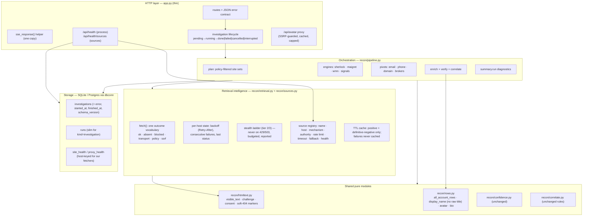
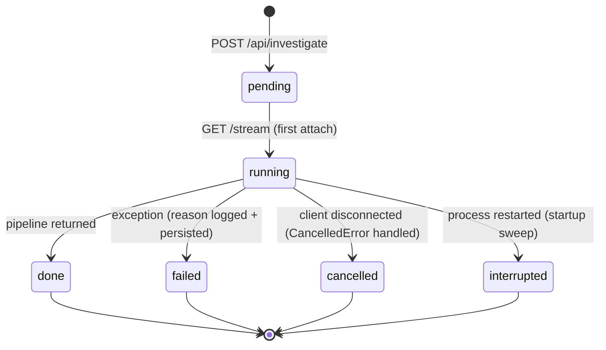

# Target architecture and engineering program

Status: **active program**, opened 2026-09-06 at commit `32c061f`. This document is the
contract every increment is reviewed against. Evidence for each decision is in
`docs/audit/2026-09-06/` (five read-only audits, line-pinned to `32c061f`) and in the
verification notes in §1.3.

Archify was **not** available in the environment; the architecture maps were produced from
code inspection and an AST import-graph script (see `docs/audit/2026-09-06/architecture-backend.md` §1).

---

## 1. Where we start

### 1.1 What the system is
A single-process FastAPI application (`app.py`, ~1.5 k lines) with SQLite (Postgres optional)
and a no-build vanilla-JS console. An investigation fans a subject's identifiers across four
username engines (Sherlock, Maigret, WhatsMyName, our own "signals" adapters/detectors),
pivots on email/phone/domain/name, then **verifies** every hit by fetching the profile page
(plain httpx → TLS-impersonated → headless browser, all robots- and SSRF-gated), scores it
(`recon/confidence.py`), correlates accounts into "same person" clusters (`recon/correlate.py`),
and renders a WebGL case graph, a footprint map, a dossier and exposure pivots.

### 1.2 What is good and must be preserved (verified in code)
* **Honesty invariants**: blocked ≠ absent; `not_examined` ≠ `lead`; correlation rules 1–6
  with the `ignored:` provenance trail; template-field stripping after verification;
  denied hosts never fetched by our own fetchers; adapter APIs use an honest User-Agent;
  Cavalier results are stripped of credentials before leaving the function.
* **Adaptive routing** for the three engines: per-(site, engine) circuit breaker, buffered
  observations flushed once per run, batched transient retry.
* **Pure-function core**: verification, confidence, correlation, graph, geo stats, breach
  summarisation are pure and tested (351 tests, ~1.3 s, no network).
* SSRF guard (`recon/safeweb.py`) re-validating every redirect hop.

### 1.3 Verified defects that drive the program
Reproduced by me against the code (not just reported):

| # | Defect | Evidence |
|---|---|---|
| V1 | A not-found page that echoes the handle in `<title>` verifies as `confirmed 72` (confidence 75–90), even when the control probe failed | `recon/verify.py` step 5 runs before the body soft-404 check; reproduced offline |
| V2 | Unlisted WAF pages: Akamai "Access Denied" → `likely_false_positive`; Imperva "Pardon Our Interruption" → `unconfirmed` lead; neither escalates | reproduced offline; marker lists differ between `verify.py` and `stealthweb.py` |
| V3 | `GET /api/investigate/{id}/stream` sets `running` and re-runs the pipeline unconditionally; client disconnect leaves the row `running` forever; the browser `EventSource` auto-reconnects on error and re-runs | 7 of 53 investigations stuck; I reproduced it on id 54 by re-opening its stream for 8 s |
| V4 | Sherlock/Maigret scan robots-denied hosts every run (5 Sherlock sites, 4 in `HIGH_VALUE_SITES`); WMN's policy rows are emitted as errors and recorded as failures | offline count; `recon/policy.py` promise holds only for our own fetchers |
| V5 | Startup fetches Sherlock's site list from GitHub with **no timeout**; offline → import error | `sherlock_project/sites.py` inspected; bundled `data.json` unused |
| V6 | Proxy "round-robin" never rotates (fresh `ProxyPool()` per run) | `recon/router.py:551` |
| V7 | A 429 in enrichment triggers 2–3 more immediate requests to the same host and poisons the host's control probe for the run; nothing is remembered | `recon/enrich.py` escalate/control paths |
| V8 | Per-run retrieval facts (error classes, degraded sites, retries, stealth usage, engine errors, failure reason) are never persisted; a `failed` row has no reason anywhere | `recon/pipeline.py` summary keys; `app.py` fatal path has no log |
| V9 | The Cytoscape graph workbench (~985 lines JS, 43 ids, ~730 KB vendor JS, two CSS blocks) is unreachable; a 168 KB vendored file is never loaded | `renderGraph` has no caller |
| V10 | Display-name precedence copied 11×; three copies (graph, report, dossier) still use the raw page `<title>`, which the correlation rules forbid | `recon/graph.py`, `report.py`, `dossier.py` |
| V11 | Profile avatars from `og:image` are loaded directly by the investigator's browser (IP/UA leak to the subject's host); no CSP | `static/js/app.js` `img.src`/`background-image` sinks |

Full inventories: `docs/audit/2026-09-06/retrieval-reliability.md` §6 (top 10),
`tech-debt.md` §1 (D1–D22), `ops-observability.md` §10 (16 gaps).

---

## 2. Principles (unchanged posture, now enforced everywhere)
1. **Public data, honest access.** Robots-denied hosts are not fetched by *any* path, including
   third-party engines. No CAPTCHA bypass. The headless tier is only for anti-bot walls on
   permitted hosts. Refusal by a source is a **source failure** that selects an alternative,
   never an obstacle to defeat.
2. **Never manufacture confidence.** Every verdict says what was checked, what failed and why.
   Unknown stays unknown. Uncertainty is communicated, not hidden.
3. **One source failing must not fail the search.** Degrade per source, record it, continue.
4. **Simplest architecture that meets the bar.** One process, one DB, no queue, no
   microservices, no build step. New capability lands as small modules with pure cores.
5. **Delete before abstracting.** Remove dead and duplicated code before adding layers.
6. **Every pure function is tested; every failure path is tested.**

---

## 3. Target component model

**Boundaries and contracts**
* `app.py` owns HTTP, SSE plumbing and the investigation state machine. It contains **no**
  scan logic (the v2 `/api/recon/stream` duplicate pipeline is removed; `/api/recon/report/{id}`
  stays for stored `kind="recon"` history rows).
* `recon/pipeline.py` receives `investigation_id`, returns the summary **including**
  `summary["run"]` (planned sets, budgets, failures by class/engine, retries, stealth counters,
  signals outcomes, fetch status histogram, phase timings). `router.finish()` runs in `finally`.
* `recon/retrieval.py` is the only place that decides *how* to fetch a page: it classifies the
  outcome into one vocabulary, applies per-host backoff, refuses to escalate on rate limits,
  and counts everything. Enrichment, detectors, the control probe and avatar downloads use it.
  Engines keep their own loops but their per-site results are **re-classified** before
  `router.observe` (a 429/403/503 status is a block, never a success).
* `recon/sources.py` is the registry of the sources *we* call directly (adapters, detectors,
  Nominatim, ipwho.is, Cavalier, DoH, RDAP, crt.sh, Gravatar, GitHub). Static facts (host,
  mechanism, authority, rate limit, timeout, fallback) plus runtime health. Exposed additively
  through `/api/health/sources`. Engine site lists remain external data; policy filtering is
  applied to them at plan time.
* `recon/htmltext.py` is the single home for HTML-to-text and marker lists (challenge,
  consent wall, soft-404). `verify.py` and `stealthweb.py` import from it.
* `recon/rows.py` is the single accessor for account-row fields; **no consumer reads the raw
  `<title>` as a name**.
* Error contract: JSON `{"error": "<message>"}` for every non-stream error (400/404/409/422);
  SSE streams keep `event: fatal` inside HTTP 200 (EventSource cannot read non-200 bodies)
  but every fatal is also logged with the investigation id and persisted to
  `investigations.error`.

---

## 4. Investigation lifecycle (state machine)

Rules: `GET /stream` on a non-`pending` row never starts a pipeline — `running` → 409
`{"error":"already running"}`; `done|failed|cancelled|interrupted` → 409 with the status (the
client loads the stored summary instead). Rerun creates a new `pending` row (unchanged). The
client closes the EventSource on `error` when `readyState === CLOSED` and never relies on
auto-reconnect to resume. Concurrency: at most N investigations run at once (semaphore, default 2);
extra streams receive a `queued` event and wait.

---

## 5. Retrieval architecture and source reliability model

**Outcome vocabulary** (single, used by `retrieval.fetch`, WMN classification, engine
re-classification, and persisted in `summary.run`):

| outcome | meaning | examples | what happens next |
|---|---|---|---|
| `ok` | a real page/JSON was retrieved | 200 with content | verify / parse |
| `absent` | decisive absence | 404, 410, adapter "not found" | `likely_false_positive` / ABSENT |
| `blocked` | the source refused or walled us | 401, 403, 429, 5xx, challenge page, consent wall, login redirect | `indeterminate`; host backoff; **no ladder on 429/503**; ladder once for 403/challenge on permitted hosts |
| `transport` | no response | DNS, TLS, timeout, connection reset | `indeterminate` with the exception class in the signal; retry once if transient |
| `policy` | robots-denied host | Instagram, Reddit, X… | `not_examined`, never fetched, never counted as an error |
| `ssrf` | URL failed the public-address guard | private IP, localhost | dropped, logged |

**Per-host state** (in-process, per run + rolling): `backoff_until` (from `Retry-After` or
default 60 s on 429/503), consecutive blocks, last status. Remaining rows on a backed-off host
are marked `indeterminate` with `reason: rate_limited` **without fetching**. A failed control
probe is recorded as `control_probe: "failed"` and never cached as "no control".

**Source ranking by authority** (already implicit, now explicit in the registry): official API
> structured endpoint > public HTML with content markers > status-only engine hit. Adapter
results are cached (positive 6 h, definitive-absent 6 h, failures never) and shared by
discovery, enrichment and timeline so GitHub is called once per handle per run.

**Fallback**: HTML blocked → adapter if one exists; challenge on a permitted host → tier 2 →
tier 3 (budgeted, exhaustion reported); pivots with a single provider degrade to
"unavailable" with a reason, never to "no result".

**Verification hardening** (V1, V2): similarity is computed after substituting both handles
with a placeholder; a headline regex catches "profile/user/page/account … not found/doesn't
exist"; a page identical to the control that carries no profile metadata is `indeterminate`
("looks like a block page"), not `likely_false_positive`; WAF marker list extended (Akamai
"Access Denied"/"Reference #", Imperva "Pardon Our Interruption"/"Incapsula incident",
AWS WAF, Kasada, "Request unsuccessful") in the **one** shared list.

**Freshness**: every verified row gets `fetched_at`; caches carry TTLs; the registry records
`last_ok_at` per source.

---

## 6. Observability model (proportional to a local single-user tool)
* **Per run → DB**: `summary["run"]` (bounded): planned site counts and budgets;
  `skipped_degraded`; `errors_by_class` and `errors_by_engine_class`; up to 300
  `failed_checks {engine, site, class, context}`; `retries {attempted, recovered}`;
  `engine_errors`; `signals` outcomes per adapter/detector; `stealth {tls_attempts, tls_ok,
  browser_attempts, browser_ok, browser_dead}`; `fetch_status_hist`; `verification_counts`;
  `timings_s` per phase. Plus `investigations.error`, `started_at`, `finished_at`.
* **Process → `/api/health`**: `db_ok`, `commit`, `uptime_s`, investigations by status
  (incl. stuck), optional deps present, stealth tier state, httpx counters by status class,
  cache hit counters, monitor last tick. Railway health check points here.
* **Logs**: timestamps; `inv=<id>` on every pipeline line via a context var; one start and one
  end line per run; `exception` on every fatal; `httpx` at WARNING; `scrapling` de-duplicated.
* **Live (SSE)**: unchanged, plus `elapsed_s` and `retries` on `done`.

The six post-mortem questions (tried / which source / why / fallback / worked / confidence)
must be answerable from `history.db` alone.

---

## 7. Data
* `runs.results` for `kind="investigation"` becomes slim (counts + `investigation_id`); the
  summary lives once in `investigations.summary`.
* `summary["schema_version"]`; `PRAGMA user_version` / `schema_version` table with an ordered
  migration list that runs on both SQLite and Postgres.
* Indexes on `runs.investigation_id`, `investigations(status)`, `watch_alerts.watch_id`.
* Startup sweep: `running` → `interrupted`. Lifespan shutdown: WAL checkpoint.
* Backup documented: `sqlite3 history.db ".backup out.db"`.

---

## 8. Security posture and decisions
Source: `docs/audit/2026-09-06/security.md` (no Critical; 1 High, 7 Medium, 5 Low, 3 Info).
Trust model: a single local analyst, no authentication by default, bound to 127.0.0.1; the
optional `APP_PASSWORD` Basic gate is for deployments. Everything fetched is untrusted input.

Decisions (owner, 2026-09-06):
1. **Tier 3 never solves challenges (F-7).** Scrapling's `solve_cloudflare` clicks Cloudflare
   Turnstile and its default `google_search=True` forges a Google referer. Both contradict the
   project's "no CAPTCHA bypass / honest client" posture and the program's security rules.
   `solve_cloudflare` is removed from every call path; `google_search=False`; a challenge page
   is a `blocked` outcome and the row is `indeterminate`. The browser tier remains for
   JS-rendered pages on permitted hosts (rendering a page is not defeating a protection).
2. **The local API is not drivable cross-site (F-1).** A middleware rejects `/api/*`
   requests whose `Sec-Fetch-Site` is `cross-site`/`same-site` or whose `Origin` is not our
   own; `TrustedHostMiddleware` allows only loopback hosts unless a deployment is configured;
   JSON endpoints require `Content-Type: application/json`. This also neutralises the headless
   browser as an amplifier: a rendered page's requests carry a foreign Origin.
3. **Policy applies to every fetch path (F-2, = V4).** Denied hosts are filtered from
   Sherlock/Maigret/WMN site sets at plan time, from holehe/ignorant module lists, and from
   avatar downloads.
4. **Untrusted content is bounded in CPU and memory (F-3, F-4).** Head-level metadata regexes
   are linear and length-capped; avatar images are rejected above 4 M pixels before decode.
5. **Rendered URLs are scheme-allow-listed (F-6)** on the client and in report/dossier; the
   console and reports carry a CSP and anti-framing headers (F-10); the God's Eye iframe
   loses `microphone` and gains `sandbox`.
6. **Limits (F-8, F-13, F-14):** ≤ 20 usernames per request, ≤ 64 KiB bodies, ≤ 500 alert ids,
   ≤ 2 concurrent investigations (429 when busy), Pydantic bodies (400 not 500),
   percent-encoded handles in fixed-host API URLs, handle character/length validation.
7. **PII (F-5):** `history.db` created with mode 0600; `DELETE /api/investigate/{id}` and
   `DELETE /api/history/{id}`; subject data out of INFO logs; README "data sent to third
   parties" table (F-11); fonts self-hosted.
8. **SSRF guard (F-9):** `_is_public_ip` requires `is_global` (excludes 100.64/10 and 6to4).
9. **Browser hygiene (F-12):** downloads disabled; cookies cleared between hosts.
10. **Supply chain (F-15, F-16):** lockfile with hashes, `pip-audit` in CI, vendored-JS
    provenance with sha256, dead bundle removed.

Verified correct and to be preserved: parameterised SQL everywhere; no subprocess; safe
static/file serving; SSE framing; escaped client rendering; `html.escape` in reports; per-hop
SSRF re-validation; policy gating on our fetchers; breach credential stripping; kill-switch
service worker; `noopener noreferrer` on every external link.

## 9. Testing strategy
* Keep the fast, network-free suite; add **HTTP-layer tests** (`tests/test_app.py`,
  `TestClient`, DB path injectable) covering error shapes, the lifecycle state machine
  (409s, cancel → `cancelled`, sweep → `interrupted`), and SSE with a stubbed pipeline.
* **Pipeline test** with stubbed engines asserting the emit contract and `summary["run"]`.
* **Failure-path tests per outcome** in `retrieval`: DNS, timeout, 403, 404, 429 with and
  without `Retry-After`, 5xx, empty body, challenge, consent wall, JS shell, login redirect.
* Verification regressions for V1/V2 with the exact reproduced pages.
* Golden tests for dossier/report rendering (escaping, empty summary, rate-limited holehe).
* CI: `ruff`, `pytest`, `node --check`, `pip-audit`; dev requirements include the stealth
  extra (or the two scrapling-dependent tests `importorskip`).
* **Merge gate**: `./scripts/gate.sh` runs the same checks locally and exits non-zero on the
  first failure; a merge is never issued from a script that does not gate on it.

---

## 10. Increments (each: own branch, tests, independent review, squash-merge)

| Inc | Scope | Acceptance criteria |
|---|---|---|
| **A** lifecycle honesty | `app.py` stream guard + state machine + startup sweep + failure reason persisted/logged; `pipeline.py` `finally: router.finish()`; `app.js` onerror close; semaphore | tests: 409 on non-pending; cancel → `cancelled`; sweep marks `interrupted`; `failed` rows carry `error`; no re-run on repeated GET |
| **B** verification correctness | `recon/htmltext.py`; V1/V2 fixes; control probe `failed`; 429/503 → no ladder + host backoff + `rate_limited`; exception class in signals; **F-7** solver removed + `google_search=False`; **F-3** linear regexes; **F-12** browser hygiene | V1/V2 pages → `likely_false_positive` / `indeterminate`; one fetch to a 429 host; `should_escalate` true for new markers; existing verify tests green |
| **C** policy completeness | plan-time filtering of Sherlock/Maigret/WMN sets by `policy`; WMN `policy` status not an error; `HIGH_VALUE_SITES` cleaned; one `not_examined` emission per denied site; **F-2** holehe/ignorant module filter + avatar policy gate; **F-4** image pixel cap | no denied host in any planned set; no `error` event or `observe` for policy rows |
| **D** startup + ops hygiene | bundled Sherlock `data.json` with timed remote refresh; logging format/levels; CI deps; `run.sh` reinstall stamp; `.gitignore`; `/api/health` | app imports offline; CI green; `/api/health` answers `db_ok` |
| **E** observability | `summary["run"]`, `investigations.error/started_at/finished_at`, `retries_done` in breakdown, WMN `query_time`, signals observed, `inv=` log context | six questions answerable from DB in a pipeline test |
| **F** dead code | remove Cytoscape stack, `graphology-library`, dead functions, dead CSS, `#graphPanel`, `download` duplicate; fix `esc()`; README/vendor docs | page loads with ≤ 4 vendor scripts; `node --check`; no reference to removed ids |
| **G** retrieval layer | `recon/retrieval.py`, `recon/sources.py`, `recon/cache.py`, `recon/rows.py`; engine 429 re-classification; watchlist false-gone; holehe rate-limited honesty; timeline dedupe; geo/breach negative-cache fix | failure-path test matrix green; GitHub called once per handle; watchlist emits no `gone` for skipped sites; dossier says "could not be determined" when holehe was rate-limited |
| **H** security hardening | **F-1** origin/host middleware; avatar proxy; CSP + headers (F-10); scheme allow-list (F-6); iframe `sandbox`; Pydantic bodies + limits (F-8, F-13, F-14); PII controls (F-5); SSRF `is_global` (F-9) | cross-site POST → 403; foreign Host → 400; no direct third-party image loads; malformed bodies → 400 JSON; 21 usernames → 400 |
| **I** data | slim `runs`, `schema_version` + migrations, indexes, WAL checkpoint, backup doc | fresh DB and upgraded DB both pass the HTTP tests |
| **J** docs + final verification | current/target/retrieval/observability/security/testing/changelog docs; live end-to-end run with failure injection; test results recorded | every deliverable in §11 present; gates green; live run clean |

Dependencies: A before E (both touch the coordinator); B before G (G builds on `htmltext`);
C independent; D independent; F independent; H after A (same handlers); I after A/E.

---

## 11. Deliverables checklist (mandate §17)
1 current architecture · 2 target architecture (this file) · 3 component dependency graph ·
4 data-flow diagram · 5 retrieval architecture · 6 source reliability model · 7 failure-handling
strategy · 8 technical-debt inventory · 9 security assessment · 10 testing strategy · 11 test
results · 12 observability strategy · 13 implementation changelog · 14 remaining risks ·
15 remaining technical debt · 16 recommended next steps. Locations are listed in
`docs/architecture/00-README.md`.
