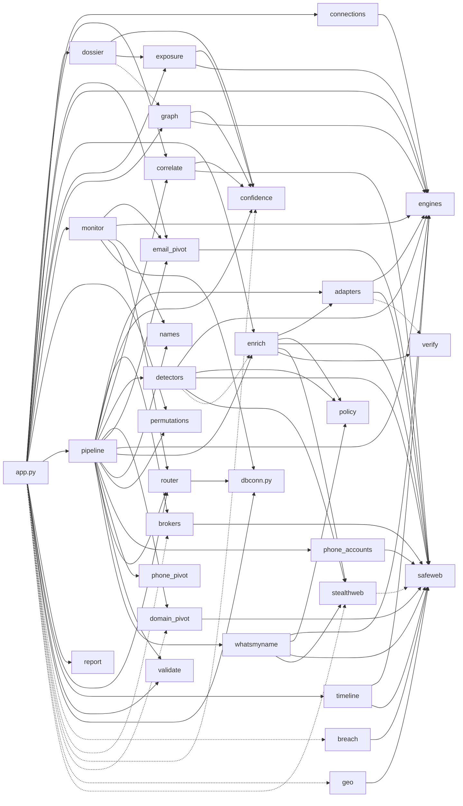

<!-- Read-only audit produced 2026-09-06 against commit 32c061f. Line numbers refer to that commit. -->
# sherlock-web — Backend Architecture Map (code-verified)

Scope: `app.py`, `dbconn.py`, `recon/*.py`, `run.sh`, `requirements*.txt`, `history.db` schema, `docs/`, `scripts/`, `.github/`. Working tree == `main` @ `32c061f`. Every claim cites `path:line`. Nothing in the repo was modified; no server started; no network calls. Offline verification: `./venv/bin/python -m pytest -q` → **351 passed, 1 skipped, 1.39s**.

Installed (venv): fastapi 0.141.1, starlette 1.6.0, uvicorn 0.52.1, sherlock-project 0.16.0, maigret 0.6.4, holehe 1.61, ignorant 1.2, httpx 0.28.1, pillow 12.3.0, phonenumbers 8.13.55, psycopg 3.3.4, scrapling 0.4.14, patchright 1.62.1, curl_cffi 0.16.0. Python 3.12 (`.python-version`).

Runtime topology: **one uvicorn process** (`run.sh:21`, `railway.json:7`) hosting a FastAPI app; SQLite (default) or Postgres via `DATABASE_URL` (`dbconn.py:27-28`); a background asyncio watchlist monitor started in the lifespan (`app.py:84-106`); Sherlock scans in daemon threads; everything else on the event loop. No job queue, no workers, no cache layer.

---

## 1. Component inventory (`recon/`)

Import graph generated by AST walk over `recon/*.py` + `app.py` (solid = module-level import, dashed = in-function/lazy import). All 32 modules appear.



Layering that falls out of the graph: `safeweb` (12 importers) and `engines` (10) are the leaf utilities; `pipeline` is the fan-in orchestrator (16 imports); `app.py` is the only importer of `pipeline`, `monitor`, `graph`, `dossier`, `report`, `connections`, `timeline`. `breach` and `geo` are reached **only** via lazy imports inside route handlers (`app.py:1262`, `app.py:1280`). External (non-stdlib) module-level imports are confined to: `enrich`→httpx, `safeweb`→httpx, `stealthweb`→scrapling (guarded try, `stealthweb.py:51-58`), `pipeline`→sherlock_project, `app`→fastapi+sherlock_project.

| Module (lines) | Purpose | Public surface (line) | Imported by |
|---|---|---|---|
| `__init__.py` (21) | Package docstring only. Lists 12 modules; **omits 19** (see §9). | — | — |
| `adapters.py` (350) | Declarative public-JSON-API existence checks per platform; return exists/absent/blocked + structured identity + temporal fields. Honest UA (`:43`). Registry of **7** adapters: GitHub, Bluesky, DEV Community, Docker Hub, Keybase, Vimeo, mastodon.social (`:156-250`). | `Adapter` (`:69`; `.check` `:105`, `.handles` `:103`, `.profile_url` `:97`), `ADAPTERS` (`:156`), `adapter_for` (`:257`), `covered_sites` (`:265`), `check_account` (`:269`), `discover` (`:277`, async, EXISTS-only), `to_verification` (`:314`); consts `EXISTS/ABSENT/BLOCKED` (`:45-47`), `TIMEOUT_S=12` (`:41`) | enrich, pipeline |
| `breach.py` (178) | Hudson Rock Cavalier infostealer lookups by email/username/domain; strips credentials, keeps exposure shape. In-process cache (`:48`). | `summarize_response` (`:72`), `collect_identifiers` (`:124`), `breach_exposure` (`:155`, async); `BASE_URL` (`:40`), `MAX_USERNAMES=5` (`:46`) | app (lazy `:1262`) |
| `brokers.py` (228) | Data-broker exposure map + opt-out links from `recon/data/data_brokers.json` (30 brokers, verified offline); best-effort presence checks on `checkable` brokers; reverse-phone deep links (NANP only). | `load_brokers` (`:67`), `name_parts` (`:79`), `parse_location` (`:86`), `build_search_url` (`:97`), `reverse_phone_links` (`:112`), `broker_exposure` (`:184`, async); `MAX_CHECKS=12` (`:52`), status consts (`:55-59`) | pipeline; app (lazy `:923`) |
| `confidence.py` (128) | Single source of truth for per-account confidence, honesty buckets, triage tiers, and correlation weights. | `AVATAR_WEIGHT=50/NAME_WEIGHT=30/BIO_WEIGHT=20/CORRELATION_LINK_MIN=40` (`:18-21`), `account_confidence` (`:53`), `verdict_bucket` (`:68`), `bucket_counts` (`:93`), `account_tier` (`:119`), `STRONG_TIER_MIN=40` (`:116`) | correlate, dossier, exposure, graph, pipeline; app (lazy `:1084`) |
| `connections.py` (145) | Pure cross-investigation identifier overlap (emails 40, phones 40, domains 30, accounts 15, registrations 10, handles 5). | `subject_identifiers` (`:43`), `find_connections` (`:100`) | app |
| `correlate.py` (657) | Clusters account rows into "same person" groups via avatar aHash (8x8 + 16x16 corroboration), cleaned display-name similarity, template-stripped bio Jaccard; union-find; six anti-false-bond rules (`:7-42`). Downloads ≤30 avatars via safeweb (`:450-483`). | `average_hash` (`:150`), `average_hash16` (`:166`), `hamming` (`:184`), `is_generic_hash` (`:188`), `names_conflict` (`:207`), `name_similarity` (`:222`), `bio_similarity` (`:233`), `is_placeholder_avatar` (`:245`), `placeholder_hashes` (`:252`), `same_account` (`:300`), `clean_display_name` (`:359`), `site_template_tokens` (`:398`), `clean_bio_tokens` (`:413`), `participates` (`:437`), `score_pair` (`:490`), `correlate` (`:575`, async) | app, pipeline |
| `detectors.py` (249) | HTML content-marker existence detectors for platforms with no JSON API (Telegram, Steam, Gravatar; `:183-210`); escalate through stealth ladder; policy-gated. | `HtmlDetector` (`:48`; `.classify` `:74`, `.check` `:93`), `DETECTORS` (`:183`), `detector_for` (`:213`), `covered_sites` (`:220`), `discover` (`:224`, async); `BROWSER_BUDGET` (`:44`, env) | pipeline |
| `domain_pivot.py` (216) | DNS over HTTPS (Cloudflare), RDAP (rdap.org), CT-log subdomains (crt.sh), reverse PTR. Pure parsers separated. | `looks_like_domain` (`:46`), `domain_from_email` (`:54`), `parse_doh` (`:67`), `parse_rdap` (`:85`), `parse_crtsh` (`:123`), `reverse_dns` (`:180`), `domain_intel` (`:191`, async) | pipeline; app (lazy `:909`) |
| `dossier.py` (624) | Self-contained print-friendly HTML dossier for an investigation (cover, exec summary, footprint score, evidence tables, graph edge list, timeline, connections, brokers, methodology). | `render_dossier(inv, summary, *, timeline=None, connections=None)` (`:308`) | app |
| `email_pivot.py` (163) | Gravatar public JSON profile + holehe registered-account checks (sequential, 0.4 s delay, 15 s/module); phone↔email trail annotation. | `masked_recovery_matches_phone` (`:29`), `annotate_recovery` (`:47`), `gravatar_lookup` (`:56`), `holehe_available` (`:93`), `holehe_scan` (`:109`, async, `only=`, `delay=`) | app, monitor, pipeline |
| `engines.py` (163) | Site-name normalisation, curated `HIGH_VALUE_SITES` (39 names, `:22-30`), Maigret DB loader (lazy, thread-safe), Maigret async scan bridge, Sherlock site subsetting. | `normalize_site` (`:40`), `maigret_available` (`:67`), `load_maigret_db` (`:75`), `maigret_site_names` (`:93`), `maigret_variant_sites` (`:97`), `DEFAULT_MAIGRET_LIMIT=1200` (`:106`), `maigret_all_sites` (`:109`), `maigret_scan` (`:139`, async), `sherlock_variant_site_data` (`:160`) | adapters, app, connections, detectors, exposure, graph, monitor, pipeline, timeline, whatsmyname |
| `enrich.py` (502) | Fetch+verify each found profile: policy gate → adapter → plain httpx (≤512 KB) → stealth ladder → control-probe soft-404 → `verify_username` → template-field stripping. Concurrency 5. | `MAX_ENRICH_PER_RUN` (`:30`, env), `STEALTH_BROWSER_BUDGET` (`:35`, env), `CONTROL_HANDLE` (`:39`), `_extract` (`:207`, used by detectors), `strip_template_fields` (`:280`), `enrich_profiles(rows, on_enriched, limit, subject_name)` (`:297`, async) | app, pipeline; detectors (lazy `:164`) |
| `exposure.py` (298) | Pure footprint score + exposure breakdown from a summary. Own curated category taxonomy (`:25-57`). | `categorize_site` (`:67`), `footprint_score` (`:76`), `exposure_summary` (`:136`) | app, dossier |
| `geo.py` (358) | Collect location claims (subject/profile/gravatar/phone/infra), geocode via Nominatim (1 req/s lock) and ipwho.is; spread/consistency stats. In-process caches. | `collect_places` (`:90`), `haversine_km` (`:150`), `footprint_stats` (`:171`), `geocode_place` (`:226`), `geolocate_ip` (`:276`), `build_footprint` (`:320`, async); `MAX_PLACES=25/MAX_IPS=8` (`:56-57`) | app (lazy `:1280`) |
| `graph.py` (393) | Build `{nodes, edges}` identity graph: person, handle pivots, accounts (tiered), gone-ghosts vs baseline, email/holehe registrations, phone/ignorant registrations, domain/IP/NS, correlation edges + cluster ids. Reads `wmn-data.json` for categories (`:38-55`). | `category_for` (`:58`), `build_graph(summary, baseline=None)` (`:86`) | app; dossier (lazy `:317`) |
| `monitor.py` (285) | Watchlist background loop: every 60 s pick ≤5 due watches, light Sherlock scan over high-value sites (thread) + holehe subset, diff signature, write alerts. Owns `watchlist`/`watch_alerts` DDL. | `init_tables` (`:43`), `light_scan` (`:110`), `compute_signature` (`:155`), `diff_signatures` (`:168`), `run_watch` (`:237`), `monitor_loop` (`:270`); `TICK_SECONDS=60/MIN_INTERVAL_HOURS=6/DEFAULT_INTERVAL_HOURS=24/LIGHT_TIMEOUT_S=8/MAX_WATCHES_PER_TICK=5` (`:29-33`) | app |
| `names.py` (128) | Full name → ≤24 ranked handle candidates (incl. nickname table). Pure. | `generate_name_candidates` (`:71`), `MAX_CANDIDATES=24` (`:19`) | monitor, pipeline |
| `permutations.py` (75) | Username → ≤24 variants (separators, reversal, vowel-strip, affixes). Pure. | `generate_variants` (`:30`), `MAX_VARIANTS=24` (`:9`) | app, pipeline |
| `phone_accounts.py` (147) | ignorant-driven phone registration checks (sequential, 0.5 s delay). | `ignorant_available` (`:33`), `ignorant_scan` (`:85`, async) | pipeline |
| `phone_pivot.py` (222) | Offline phonenumbers parsing + format variants + footprint dork links. | `DEFAULT_REGION` (`:33`, env), `phonenumbers_available` (`:62`), `footprint_links` (`:91`), `phone_footprint` (`:138`), `phone_intel` (`:147`) | pipeline |
| `pipeline.py` (698) | The unified investigation orchestrator (§5). | `run_pipeline(...)` (`:138`, async, kw-only), `NAME_SHERLOCK_SHARDS=3` (`:46`), `NAME_MAIGRET_CONCURRENCY=3` (`:47`), `ERROR_STATUSES` (`:43`) | app |
| `policy.py` (85) | robots.txt-derived deny list of 12 host suffixes (`:29-42`); denied URLs are never fetched and get a `not_examined` verdict. | `DENIED_HOSTS` (`:29`), `denied_reason` (`:57`), `is_denied` (`:74`), `not_examined_verdict` (`:78`) | detectors, enrich, whatsmyname |
| `report.py` (213) | v2 "deep recon" HTML report (dark theme). | `render_report(run)` (`:80`) | app |
| `router.py` (724) | Adaptive routing: error taxonomy, SQLite-backed per-(site,engine) health with circuit breaker, buffered observations flushed at run end, one-shot batched transient retries, optional proxy pool. Owns `site_health`/`proxy_health` DDL. | `classify` (`:101`), `should_trip` (`:168`), `next_cooldown` (`:180`), `partition_sites` (`:185`), `select_retries` (`:193`), `proxy_should_ban` (`:198`), `retry_delay` (`:203`), `init_tables` (`:228`), `SiteHealthStore` (`:258`; `record` `:339`, `record_batch` `:355`, `open_circuits` `:381`, `all_rows` `:402`, `record_proxy` `:427`, `banned_proxies` `:458`), `ProxyPool` (`:479`; `pick` `:500`), `RunRouter` (`:523`; `filter_sites` `:559`, `announce_skipped` `:575`, `observe` `:589`, `drain_transient` `:618`, `finish` `:638`, `breakdown` `:655`), `sources_summary` (`:668`); tuning consts (`:149-165`) | app, monitor, pipeline |
| `safeweb.py` (145) | SSRF-guarded `httpx.AsyncClient` factory (request hook re-validates every hop), shared Chrome UA (`:36-39`), capped streaming GET. | `BlockedRequestError` (`:44`), `assert_public_url` (`:70`), `async_client` (`:110`), `fetch_capped` (`:125`) | adapters, breach, brokers, correlate, detectors, domain_pivot, email_pivot, enrich, geo, phone_accounts, timeline, whatsmyname; stealthweb (lazy) |
| `stealthweb.py` (306) | Optional Scrapling ladder: tier 2 TLS-impersonated GET (`fetch_tls`), tier 3 shared headless stealth browser (`fetch_browser`, lazily `start()`ed, self-disables after first launch failure). Pre-validates URLs via `safeweb.assert_public_url`. | `enabled` (`:69`), `visible_text` (`:118`), `has_challenge_markers` (`:127`), `looks_like_shell` (`:135`), `should_escalate` (`:142`), `fetch_tls` (`:166`), `fetch_browser` (`:252`), `aclose` (`:298`) | detectors, enrich, whatsmyname; app (lazy `:103`) |
| `timeline.py` (195) | Assemble sorted subject timeline; GitHub `created_at` lookups (≤15) via public API. | `github_login_from_url` (`:47`), `parse_ts` (`:71`), `build_timeline` (`:93`), `account_events` (`:128`), `account_creation_dates` (`:151`, async) | app |
| `validate.py` (24) | Pragmatic email regex. | `is_probably_email` (`:19`) | app, pipeline |
| `verify.py` (323) | Advisory verdict for a fetched page: `confirmed` / `likely_false_positive` / `indeterminate` / `unconfirmed`, with control-probe similarity and structured-name attribution. Pure; never raises. | `verify_username(username, url, html, extracted, *, status, control_html, control_extracted, subject_name)` (`:218`) | enrich; adapters (lazy `_identity_matches` `:341`) |
| `whatsmyname.py` (201) | Third username engine over vendored `recon/data/wmn-data.json` (649 usable GET sites, 30 high-value; verified offline). Concurrency 20; policy-gated; budgeted tier-2 stealth retry on high-value UNKNOWNs. | `WmnResult` (`:55`), `load_sites` (`:64`), `all_sites(nsfw=False)` (`:87`), `variant_sites` (`:93`), `classify_response` (`:99`), `whatsmyname_scan` (`:171`, async); `WMN_CONCURRENCY=20` (`:38`), `_STEALTH_RETRY_BUDGET` (`:43`, env) | pipeline |

Root modules: `dbconn.py` (102) — backend selector; `PK` (`:33`), `_PgConnection` adapter (`:45-73`), `connect()` (`:76`, SQLite: WAL + busy_timeout 5000 ms + synchronous=NORMAL `:88-90`), `insert_returning_id` (`:94`). `migrate_to_postgres.py` (85) — one-shot SQLite→Postgres copy; imports `app` for DDL side effect (`:52`).

---

## 2. HTTP API surface

All routes live in `app.py`. Handlers marked **sync** are plain `def` and are run by Starlette in its threadpool; **async** run on the loop. Routes in the `if RECON_AVAILABLE:` block (`app.py:507-1454`) exist only when the recon package imports; otherwise a single stub `/api/recon/stream` is registered (`app.py:1456-1463`) and every other recon route 404s.

Global middleware: `basic_auth_gate` (`app.py:120-138`) — when `APP_PASSWORD` is set, every request (incl. `/`, SSE, `/static`) needs HTTP Basic with that password, any username; constant-time compare (`:129`).

| Method | Path | Handler (line) | Sync/Async | Request | Response | SSE |
|---|---|---|---|---|---|---|
| GET | `/api/history` | `get_history` (225) | sync | — | `[{id, ts, username, found, total, kind, investigation_id}]`, newest 50 (`:229-231`) | no |
| GET | `/api/history/{run_id}` | `get_run` (239) | sync | path int | row + `results` parsed JSON; 404 `{error}` | no |
| GET | `/api/sites` | `get_sites` (267) | sync | — | `[{name, nsfw}]` sorted ci (433 sites, 18 NSFW in installed Sherlock) | no |
| GET | `/api/health/sources` | `get_health_sources` (279) | sync | — | `sources_summary`: `{available, sites[{site, engine, observations, failure_rate, dominant_error, consecutive_failures, circuit, circuit_open_until, cooldown_remaining_s, ewma_latency_ms, updated_at}], aggregate{sites_tracked, circuits_open, observations, overall_failure_rate}}` (`router.py:696-723`) | no |
| GET | `/api/search/stream` | `search_stream` (429) | async | `usernames` (required, comma/newline), `timeout` int 1–120 default 10, `nsfw` bool, `sites` csv (`:432-435`) | `text/event-stream`; headers `Cache-Control: no-cache`, `X-Accel-Buffering: no` (`:498`) | **yes** |
| GET | `/api/recon/stream` | `recon_stream` (557) | async | `usernames` "", `email` "", `variants` false, `timeout` 10, `nsfw` false, `sites` "" (`:560-565`); email-only → local part used as username (`:574-575`) | SSE | **yes** |
| GET | `/api/recon/report/{run_id}` | `recon_report` (853) | sync | path int | `text/html` via `render_report`; minimal report for `kind='sherlock'` rows (`:872-886`); 404 text | no |
| GET | `/api/domain` | `domain_lookup` (906) | async | `domain` (required) | `domain_intel` dict; 400 if not a domain | no |
| GET | `/api/brokers` | `broker_lookup` (917) | async | `name` (required), `location` "" | `broker_exposure` dict; 400 if empty name | no |
| POST | `/api/investigate` | `create_investigation` (961) | async | JSON `{name?, usernames? (str\|list), email?, phone?, domain?, location?, variants?, thorough?, timeout?}`; timeout clamped 1–120 (`:985`) | `{investigation_id}`; 400 on bad JSON / no inputs / bad email | no |
| GET | `/api/investigate/{inv_id}` | `get_investigation` (1013) | sync | path int | `{id, created_at, inputs, summary\|null, status}`; 404 | no |
| POST | `/api/investigate/{inv_id}/rerun` | `rerun_investigation` (1020) | sync | path int | `{investigation_id, inputs, rerun_of}` — new `pending` row cloned from inputs | no |
| GET | `/api/investigate/{inv_id}/stream` | `investigate_stream` (1042) | async | path int, `nsfw` bool (`:1044`) | SSE; sets status `running` first (`:1053`) | **yes** |
| GET | `/api/investigate/{inv_id}/graph` | `investigate_graph` (1126) | sync | path int | `build_graph(summary, baseline)` → `{nodes, edges}`; baseline = latest earlier `done` investigation with byte-identical `inputs` JSON (`:1138-1147`); 404 / 409 "has not run yet" | no |
| GET | `/api/investigate/{inv_id}/exposure` | `investigate_exposure` (1242) | sync | path int | `{investigation_id, status, exposure}` (works on empty summary) | no |
| GET | `/api/investigate/{inv_id}/breach` | `investigate_breach` (1253) | async | path int | `{investigation_id, checked, identifiers_checked, compromised_count, results[], source\|note}`; 409 without summary; on exception logs + `{checked:false,...}` (`:1263-1268`) | no |
| GET | `/api/investigate/{inv_id}/footprint` | `investigate_footprint` (1271) | async | path int | `{investigation_id, points[], unresolved[], stats{}}`; 409; exception → empty (`:1281-1286`) | no |
| GET | `/api/investigate/{inv_id}/timeline` | `investigate_timeline` (1289) | async | path int | `{investigation_id, generated_at, timeline[{date, kind, title, detail, dated}]}` | no |
| GET | `/api/investigate/{inv_id}/connections` | `investigate_connections` (1301) | sync | path int | `{investigation_id, checked, connections[{investigation_id, label, strength, shared{}, summary}]}` | no |
| GET | `/api/investigate/{inv_id}/report` | `investigate_report` (1314) | async | path int | `text/html` dossier (timeline + connections folded in, each swallowed to `None` on error `:1322-1329`); 404/409 text | no |
| GET | `/api/watchlist` | `list_watchlist` (1338) | sync | — | `[{id, created_at, label, inputs, interval_hours, last_run_at, enabled, alerts}]` | no |
| POST | `/api/watchlist` | `create_watch` (1356) | async | JSON `{inputs{usernames (str\|list), email, name}, label?, interval_hours?}`; interval ≥ 6 h default 24 (`:1377-1379`) | `{watch_id, label, interval_hours}`; 400 | no |
| POST | `/api/watchlist/{watch_id}/toggle` | `toggle_watch` (1392) | sync | path int | `{id, enabled}`; 404 | no |
| DELETE | `/api/watchlist/{watch_id}` | `delete_watch` (1405) | sync | path int | `{deleted}`; 404 (alerts deleted first `:1408`) | no |
| GET | `/api/alerts` | `list_alerts` (1416) | sync | `unseen` bool | `[{id, watch_id, created_at, kind, message, data, seen, watch_label}]` newest 100 | no |
| POST | `/api/alerts/mark_seen` | `mark_alerts_seen` (1435) | async | JSON `{ids?: []}`; empty → mark all unseen (`:1450`) | `{ok:true}` | no |
| GET | `/api/recon/stream` (fallback) | `recon_stream_unavailable` (1458) | async | — | single `fatal` SSE event; **only registered when `RECON_AVAILABLE` is False** | yes |
| GET | `/` | `index` (1470) | sync | — | `static/index.html` | no |
| GET | `/manifest.webmanifest` | `web_manifest` (1476) | sync | — | file, `application/manifest+json` | no |
| GET | `/sw.js` | `service_worker` (1483) | sync | — | file, `Service-Worker-Allowed: /`, `Cache-Control: no-cache` | no |
| GET | `/api/godseye/status` | `godseye_status` (1513) | sync | — | `{url, reachable}` — reachability is a 1 s **TCP connect** to `GODSEYE_URL` host:port (`:1500-1510`) | no |
| — | 404 handler | `not_found` (1521) | async | — | `static/404.html` when `Accept: text/html` and path not under `/api/`; else `{error:"not found", path}` | — |
| mount | `/static` | `StaticFiles` (1533) | — | — | icons, css, js, vendor | — |

Frontend usage (grep of `static/js/app.js`): calls `/api/sites`, `/api/history[/id]`, `/api/search/stream`, `/api/health/sources`, `/api/investigate`, `/api/investigate/{id}` + `/stream`, `/rerun`, `/graph`, `/report`, `/footprint`, `/breach`, `/api/watchlist*`, `/api/alerts*`, `/api/godseye/status`. **Zero references** to `/api/recon/stream`, `/api/recon/report`, `/api/domain`, `/api/brokers`, `/exposure`, `/timeline`, `/connections` (the last three are consumed server-side by the dossier only, `app.py:1321-1332`).

### 2.1 SSE wire format and event protocol

Every stream is `event: <name>\ndata: <json>\n\n` (`app.py:489,842,1115`), with a `: keepalive\n\n` comment every 15 s of queue silence during which `request.is_disconnected()` is polled (`app.py:479-484, 832-837, 1105-1110`). Events are produced into an `asyncio.Queue`; a `None` sentinel ends the stream. Worker threads publish via `loop.call_soon_threadsafe(queue.put_nowait, ...)` (`app.py:312-314, 349`).

**A. `/api/search/stream`** (classic Sherlock; producer `_run_scan` `app.py:343-426`)

| event | payload keys | source |
|---|---|---|
| `meta` | `usernames, sites_total, timeout, nsfw` | `app.py:468-474` (sites_total is pre-circuit-filter count; see §9) |
| `skipped_degraded` | `count, sites[{site, engine, until}]` | `router.py:582-585` via `announce_skipped` (`app.py:353`) |
| `user_start` | `username, total` | `app.py:359-362` |
| `found` | `site, url, query_time, username` | `app.py:323-329` |
| `error` | `site, status, context, username` | `app.py:332-339` (Sherlock `Unknown/WAF/Illegal` only; `Available` is silent `:340`) |
| `progress` | `checked, total, username` | `app.py:373` |
| `retry` | `engine, site, username, class` | `app.py:392` (rec shape from `router.py:606-609`) |
| `user_done` | `username, found, total` | `app.py:411-417` |
| `fatal` | `message` | `app.py:420`; also pre-stream for no usernames (`:441`) |
| `done` | `runs[{username, found, total}], error_breakdown{class:count}, degraded_sources` | `app.py:424` + `router.py:657-660` |

**B. `/api/recon/stream`** (v2; coordinator `app.py:726-825`)

| event | payload keys | line |
|---|---|---|
| `meta` | `usernames, email, variants, timeout, nsfw, sherlock_sites, maigret_sites` | 743 |
| `engine_start` | `engine, username, total, variant_of` | 645 |
| `found` | `username, site, url, engines[], variant_of, query_time` | 613 |
| `merged` | `username, site, engines[], variant_of` | 601 |
| `error` | `engine, username, site, status, context, variant_of` | 617 |
| `progress` | `engine, username, checked, total, variant_of` | 623 |
| `engine_done` | `engine, username, variant_of` | 651 |
| `engine_error` | `engine, message` | 656 |
| `variants_planned` | `base, variants[], sites` | 772 |
| `phase` | `phase:"enriching", targets` | 783 (targets hard-coded `min(40, n)`; see §9) |
| `enriched` | `username, site, url, variant_of, enrichment{}, verification{}` | 786 |
| `correlation` | `clusters[]` | 796 |
| `email` | `source:"gravatar", email, found, profile` \| `source:"holehe", email, site, domain, exists, rate_limit, email_recovery, phone_number, others` \| `source:"holehe", email, error` | 708/715/719 |
| `email_done` | `email, holehe_hits, gravatar` | 722 |
| `done` | `history_id, found, variant_hits, clusters, email_hits` | 814 |
| `fatal` | `message` | 823; pre-stream 571/578 |

Note: v2 has **no** `skipped_degraded`/`retry` (no `RunRouter` is constructed in this path) — see §9.

**C. `/api/investigate/{id}/stream`** (v3; `app.py:1063-1097` + `recon/pipeline.py`)

| event | payload keys | source |
|---|---|---|
| `meta_run` | `investigation_id` | `app.py:1102` (yielded before the queue loop) |
| `skipped_degraded` | `count, sites[{site, engine, until}]` | `router.py:582` via `pipeline.py:523` |
| `meta` | `name, usernames, email, phone, domain, variants, thorough, timeout, sherlock_sites, maigret_sites, whatsmyname_sites, candidate_sites, candidates` | `pipeline.py:525-532` |
| `candidates` | `name, candidates[]` | `:535` |
| `phone_intel` | full `phone_state` dict (see §4) | `:546` |
| `engine_start` | `engine, username, total, source, variant_of, from_name, candidate` | `:258-263` |
| `engine_done` | `engine, username, source, variant_of, from_name, candidate` | `:266-271` |
| `engine_error` | `engine, message` | `:273` |
| `found` | `username, site, url, engines[], query_time, category, source, variant_of, from_name, candidate` | `:232` (row copy) |
| `merged` | `username, site, engines[], category, source, variant_of, from_name, candidate` | `:211-218` |
| `error` | `engine, username, site, status, context, source, variant_of, from_name, candidate` | `:235-241` |
| `progress` | `engine, username, checked, total, source, variant_of, from_name, candidate` | `:244-250` |
| `retry` | `engine, site, username, class` | `:253` (sherlock via thread), `:341` (maigret), `:398` (whatsmyname) |
| `variants_planned` | `base, variants[], sites` | `:605` |
| `email` / `email_done` | as in B (+ `corroborates_phone` on holehe entries, `email_pivot.py:52`) | `:447-465` |
| `domain_intel` | `domain_intel` dict | `:471` |
| `broker_exposure` | `broker_exposure` dict | `:477` |
| `phone_account` | `phone, site, domain, exists, rate_limit, method` \| `phone, error` | `:487/491` |
| `phone_account_done` | `phone, hits` | `:494` |
| `phase` | `phase:"enriching", targets=min(MAX_ENRICH_PER_RUN, n)` | `:625` |
| `enriched` | `username, site, url, source, variant_of, from_name, candidate, enrichment{}, verification{}, confidence, temporal, platform_identity` | `:629-640` |
| `correlation` | `clusters[]` | `:646` |
| `done` | `found, leads, flagged, indeterminate, not_examined, hits, variant_hits, name_hits, clusters, email_hits, phone, phone_accounts, domain, brokers, error_breakdown, degraded_sources` | `:679-697` |
| `saved` | `history_id, investigation_id` | `app.py:1091` |
| `fatal` | `message` | `app.py:1095`; pre-stream `:1049` |

Engine identifiers used in payloads: `"sherlock"`, `"maigret"`, `"whatsmyname"`, `"signals"` (`pipeline.py:73, 304, 364, 424`).

---

## 3. Request-path diagrams

### 3a. POST /api/investigate → stream → summary persisted

```mermaid
sequenceDiagram
  autonumber
  participant C as Browser
  participant A as app.py (FastAPI)
  participant DB as SQLite/PG (dbconn)
  participant P as recon.pipeline.run_pipeline
  participant T as Sherlock threads
  participant E as Maigret/WMN/Signals tasks
  participant R as RunRouter

  C->>A: POST /api/investigate {usernames,...}
  A->>A: validate, clamp timeout (app.py:971-1003)
  A->>DB: INSERT investigations(status='pending') (app.py:1004-1010)
  A-->>C: {investigation_id}

  C->>A: GET /api/investigate/{id}/stream?nsfw=
  A->>DB: SELECT investigations (app.py:1046)
  A->>DB: UPDATE status='running' (app.py:1053)
  A->>A: asyncio.create_task(coordinator) (app.py:1099)
  A-->>C: SSE open, event meta_run (app.py:1102)

  A->>P: await run_pipeline(..., emit, loop, db_path) (app.py:1068)
  P->>R: RunRouter(db_path, emit) (pipeline.py:502)
  R->>DB: SELECT site_health open circuits (router.py:388-395)
  P->>R: filter_sites x4, announce_skipped (pipeline.py:503-523)
  R-->>C: event skipped_degraded (router.py:582)
  P-->>C: event meta, candidates, phone_intel (pipeline.py:525-546)

  par base handles
    P->>T: threading.Thread(_sherlock_worker) (pipeline.py:281)
    T-->>P: call_soon_threadsafe found/error/progress (pipeline.py:185-196)
    P->>E: create_task maigret_worker / whatsmyname_worker / signals_worker (pipeline.py:552-555)
  and pivots
    P->>E: create_task email/domain/broker/phone_accounts (pipeline.py:581-590)
  and name candidates (3 shards, sem 3)
    P->>T: start_sherlock(cand_items, sher_reduced, shards=3) (pipeline.py:568)
    P->>E: maigret/wmn concurrency=3 (pipeline.py:570-575)
  end
  Note over P,R: every per-site result -> router.observe (buffered in memory)
  P->>P: await base; variants phase sequential per base (pipeline.py:593-615)
  P->>P: await candidates (pipeline.py:617-621)
  P-->>C: event phase enriching (pipeline.py:625)
  P->>E: enrich_profiles(all_rows) sem 5, adapters, stealth ladder (enrich.py:297)
  E-->>C: event enriched per row (pipeline.py:629)
  P->>E: correlate(all_rows) avatar downloads (correlate.py:575)
  P-->>C: event correlation (pipeline.py:646)
  P->>P: await email/domain/broker/phone tasks (pipeline.py:649-656)
  P->>R: router.finish() -> record_batch in ONE txn (router.py:638-653)
  R->>DB: UPSERT site_health rows, proxy_health
  P-->>C: event done (pipeline.py:679)
  P-->>A: return summary dict (pipeline.py:698)

  A->>DB: UPDATE investigations status='done', summary=json (app.py:1079, 946-954)
  A->>DB: INSERT runs(kind='investigation', results=summary, investigation_id) (app.py:1088, 205-222)
  A-->>C: event saved {history_id, investigation_id} (app.py:1091)
  A->>A: queue.put(None) sentinel -> stream ends (app.py:1097, 1112)
```

Failure paths: any exception in the coordinator → `status='failed'` + `fatal` (`app.py:1093-1095`). Client disconnect → `event_gen` sees `CancelledError`, cancels `coord_task` (`app.py:1116-1118`); `CancelledError` is **not** caught by `except Exception`, so the row stays `running` (§9).

### 3b. GET /api/search/stream (classic Sherlock)

```mermaid
sequenceDiagram
  autonumber
  participant C as Browser
  participant A as search_stream (app.py:429)
  participant Q as asyncio.Queue
  participant W as _run_scan daemon thread (app.py:343)
  participant R as RunRouter
  participant S as sherlock()
  participant DB as runs table

  C->>A: GET /api/search/stream?usernames=&timeout=&nsfw=&sites=
  A->>A: parse names, build site_data subset (app.py:438-453)
  A->>W: threading.Thread(daemon=True).start() (app.py:459-464)
  A-->>C: event meta (app.py:474)
  W->>R: RunRouter(DB_PATH, emit=_emit_ts) (app.py:351)
  W->>R: filter_sites(site_data,'sherlock'); announce_skipped (app.py:352-353)
  R-->>Q: skipped_degraded (if any)
  loop per username
    W-->>Q: user_start (app.py:359)
    W->>S: sherlock(username, site_data, QueueNotify, timeout, proxy=router.proxy) (app.py:377)
    S-->>W: QueryNotify.update per site (app.py:316)
    W->>R: router.observe(...) (app.py:319)
    W-->>Q: found | error, then progress (app.py:323-339, 373)
    W->>R: drain_transient('sherlock', username) (app.py:385)
    opt transient failures
      W-->>Q: retry x N (app.py:392)
      W->>W: time.sleep(retry_delay 2-5s) (app.py:393)
      W->>S: sherlock(username, retry_sites, ...) (app.py:395)
    end
    W->>DB: save_run(username, found, total, [{site,url}]) kind='sherlock' (app.py:407)
    W-->>Q: user_done (app.py:411)
  end
  W->>R: router.finish() flush site_health (app.py:423)
  W-->>Q: done {runs, error_breakdown, degraded_sources} then None (app.py:424-426)
  loop event_gen (app.py:466-493)
    A->>Q: await get(timeout=15)
    alt item
      A-->>C: event X data json
    else timeout
      A->>A: request.is_disconnected()? break : yield keepalive
    end
  end
```

The thread is never joined or cancelled on disconnect; it finishes and still writes `runs` (`app.py:490-493` comment).

### 3c. Read-side endpoints over a stored summary

```mermaid
sequenceDiagram
  autonumber
  participant C as Browser
  participant A as app.py
  participant DB as investigations table
  participant G as recon.graph
  participant GEO as recon.geo
  participant BR as recon.breach
  participant N as Nominatim / ipwho.is
  participant HR as Hudson Rock Cavalier

  C->>A: GET /api/investigate/{id}/graph
  A->>DB: _get_investigation (app.py:930-944)
  A->>DB: SELECT summary WHERE inputs=? AND id<? AND status='done' (app.py:1139-1145)
  A->>G: build_graph(summary, baseline) (app.py:1150)
  G-->>A: {nodes, edges} pure, no I/O (graph.py:86-393)
  A-->>C: JSON

  C->>A: GET /api/investigate/{id}/footprint
  A->>DB: _get_investigation; 409 if no summary (app.py:1274-1279)
  A->>GEO: build_footprint(summary) (app.py:1282)
  GEO->>GEO: collect_places (pure) (geo.py:90)
  GEO->>N: geocode_place serial, 1 req/s lock, cached (geo.py:226-273)
  GEO->>N: geolocate_ip concurrent, public IPs only, cached (geo.py:276-317)
  GEO-->>A: {points, unresolved, stats}
  A-->>C: JSON (exception -> empty shape, app.py:1283-1286)

  C->>A: GET /api/investigate/{id}/breach
  A->>DB: _get_investigation; 409 if no summary (app.py:1256-1261)
  A->>BR: breach_exposure(summary) (app.py:1264)
  BR->>BR: collect_identifiers: email, domain, first 5 usernames (breach.py:124-152)
  BR->>HR: GET search-by-{email|username|domain} concurrently, cached (breach.py:94-121)
  BR-->>A: {checked, identifiers_checked, compromised_count, results, source}
  A-->>C: JSON (exception -> checked:false, app.py:1265-1268)
```

Sync read handlers (`graph`, `exposure`, `connections`, `get_investigation`, history, watchlist, alerts) execute in Starlette's threadpool; each opens a fresh DB connection per call (`dbconn.connect` `:76-91`).

---

## 4. Data model

### 4.1 SQLite tables (from `PRAGMA table_info` on `history.db`; journal_mode=wal)

DDL owners: `runs`, `investigations` → `app.py:_init_db` (`:155-200`); `watchlist`, `watch_alerts` → `recon/monitor.py:init_tables` (`:43-70`); `site_health`, `proxy_health` → `recon/router.py:init_tables` (`:228-255`). All created with `CREATE TABLE IF NOT EXISTS` at **import time** (`app.py:202`).

| Table | Columns (type, notnull, default) | Writers | Readers |
|---|---|---|---|
| `runs` | `id` INTEGER PK AUTOINCREMENT; `ts` TEXT NN; `username` TEXT NN; `found` INTEGER NN; `total` INTEGER NN; `results` TEXT NN (JSON); `kind` TEXT NN DEFAULT 'sherlock'; `investigation_id` INTEGER | `save_run` (`app.py:205-222`) called from `_run_scan` (`:407`, kind sherlock), recon coordinator (`:812`, kind recon), investigate coordinator (`:1088`, kind investigation) | `get_history` (`:227`), `get_run` (`:241`), `recon_report` (`:855`), `_investigation_timeline` (`:1196`) |
| `investigations` | `id` PK; `created_at` TEXT NN; `inputs` TEXT NN (JSON); `summary` TEXT (JSON, nullable); `status` TEXT NN DEFAULT 'pending' | INSERT `create_investigation` (`:1004`), `rerun_investigation` (`:1032`); UPDATE `_set_investigation` (`:946-959`: pending→running→done\|failed) | `_get_investigation` (`:930`), graph baseline (`:1138`), `_all_investigation_idents` (`:1162`) |
| `watchlist` | `id` PK; `created_at` TEXT NN; `label` TEXT NN; `inputs` TEXT NN (JSON); `interval_hours` INTEGER NN; `last_run_at` TEXT; `last_signature` TEXT (JSON); `enabled` INTEGER NN DEFAULT 1 | INSERT `create_watch` (`:1380`); UPDATE `toggle_watch` (`:1401`), `monitor.run_watch` (`:242` last_run_at, `:260` last_signature); DELETE `delete_watch` (`:1410`) | `list_watchlist` (`:1340`), `toggle_watch` (`:1394`), `_investigation_timeline` (`:1202`), `monitor._due_watches` (`:213`) |
| `watch_alerts` | `id` PK; `watch_id` INTEGER NN; `created_at` TEXT NN; `kind` TEXT NN; `message` TEXT NN; `data` TEXT (JSON); `seen` INTEGER NN DEFAULT 0 | INSERT `monitor.run_watch` (`:253-259`); UPDATE `mark_alerts_seen` (`:1444/1450`); DELETE `delete_watch` (`:1408`) | `list_watchlist` counts (`:1345`), `list_alerts` (`:1426`), `_investigation_timeline` (`:1205`) |
| `site_health` | `site` TEXT NN; `engine` TEXT NN; `window` TEXT NN DEFAULT '[]' (JSON list of `{ok, class, ts}`, ≤50); `ewma_latency_ms` REAL; `consecutive_failures` INTEGER NN DEFAULT 0; `circuit_open_until` TEXT; `cooldown_seconds` INTEGER NN DEFAULT 900; `updated_at` TEXT NN; PK(site, engine) | UPSERT `SiteHealthStore._write_state` (`router.py:320-337`) via `record` (`:339`) / `record_batch` (`:355`, the only production path, from `RunRouter.finish` `:650`) | `_load_state` (`:280`), `open_circuits` (`:381`), `all_rows` (`:402`) → `sources_summary` |
| `proxy_health` | `proxy` TEXT PK; `uses` INTEGER NN DEFAULT 0; `failures` INTEGER NN DEFAULT 0; `banned_until` TEXT; `updated_at` TEXT NN | UPSERT `record_proxy` (`router.py:446-454`) from `RunRouter.finish` (`:653`) | `record_proxy` (`:434`), `banned_proxies` (`:463`) |

No FKs, no indexes beyond PKs (`sqlite_master` shows only the two autoindexes for the composite/text PKs). Timestamps are local-time `"%Y-%m-%d %H:%M:%S"` strings (`app.py:214`, `router.py:212-216`, `monitor.py:208-209`).

**Migrations:** there is no migration framework (no `alembic/` or `migrations/` dir; no alembic in `requirements*.txt`; `docs/specs/01-postgres-migration.md` *proposes* Alembic but it is unimplemented). The only schema evolution is an inline, SQLite-only `ALTER TABLE runs ADD COLUMN kind` / `investigation_id` guarded by `PRAGMA table_info` (`app.py:175-185`). On Postgres (`dbconn.IS_POSTGRES`) that block is skipped and tables are assumed fresh.

### 4.2 JSON blobs

**`investigations.inputs`** (`app.py:976-986`, mutated at `:1001-1003`): `{name, usernames[], email, phone, domain, location, variants, thorough, timeout}`. Watch `inputs` are free-form `{usernames[], email, name}` (`app.py:1362-1367`).

**`investigations.summary`** == return of `run_pipeline` (`pipeline.py:658-673`), also duplicated verbatim into `runs.results` for `kind='investigation'` (`app.py:1088`):

```
{
  params:        {name, usernames[], email, phone, domain, location, variants, thorough, timeout},
  candidates:    [str],                 # name-derived handles (names.py)
  accounts:      [AccountRow],          # source == "base"
  variants:      [AccountRow],          # source == "variant"
  name_accounts: [AccountRow],          # source == "name"
  email:         {gravatar: Gravatar|null, holehe: [HoleheEntry]},
  phone:         PhoneState|null,
  domain:        DomainIntel|null,
  brokers:       BrokerExposure|null,
  correlation:   [Cluster]
}
```

**AccountRow** — created at `pipeline.py:220-228`, mutated in place by enrichment and correlation:

| key | set by | values |
|---|---|---|
| `username, site, url` | `pipeline.py:221` | scanned handle, engine's site label, profile URL |
| `engines` | `:222`, appended on merge `:205` | subset of `["sherlock","maigret","whatsmyname","signals"]` |
| `query_time` | `:222` | float (sherlock) or `None` |
| `category` | `:223`, `:208` | WMN category string or `None` |
| `source` | `:224` | `"base" \| "variant" \| "name"` |
| `variant_of, from_name, candidate` | `:225-227` | group metadata (mostly `None`) |
| `verification` | `enrich.py:336-341` (budget), `:410` (policy), `:427` (adapter), `:476` (page) | `{status, score, signals[], reason?, identity_match?, control_probe?, source?}`; `status ∈ {confirmed, unconfirmed, likely_false_positive, indeterminate, not_examined}` (`verify.py:9-20`, `policy.py:78-85`, `adapters.py:315-351`); `reason ∈ {budget_exhausted, access_policy}`; `control_probe ∈ {ran, not_applicable, null}` (`verify.py:227-228`); `source:"adapter"` when adapter-derived |
| `enrichment` | `enrich.py:439` (adapter-mapped), `:488` (page) | `{title?, og_title?, og_description?, og_image?, jsonld_name?, jsonld_description?, jsonld_image?, template_fields?[]}` (`enrich.py:96-119, 139-204, 280-294`) |
| `platform_identity` | `enrich.py:441` | adapter `identity` map e.g. `{canonical_handle, account_id, display_name, avatar, bio, location, company, blog, twitter, account_type, followers, public_repos, ...}` (`adapters.py:161-167` et al.) |
| `temporal` | `enrich.py:443` | e.g. `{created_at, last_profile_update \| indexed_at \| last_active}` (`adapters.py:168,181,194,205,218,231,244`) |
| `evidence_source` | `enrich.py:444` | adapter API URL |
| `fetch_via` | `enrich.py:462` | `"scrapling_tls" \| "scrapling_browser" \| "httpx"` — **present only when the stealth ladder rescued content**; absent for plain fetches |
| `avatar_hash` / `avatar_hash16` | `correlate.py:477-478` | 64-bit / 256-bit ints (JSON-serialised as big ints) |

`confidence` is **not** stored on rows; it is recomputed on read via `confidence.account_confidence` (graph `graph.py:140`, exposure `exposure.py:213`, dossier `dossier.py:14`) and only appears in the `enriched` SSE payload (`pipeline.py:637`).

**HoleheEntry** (`email_pivot.py:141-156`): `{site, domain, exists, rate_limit, email_recovery, phone_number, others}` or `{site, exists:false, rate_limit:false}` or `{site, exists:null, error}`; `corroborates_phone: true` added when masked recovery digits match the subject phone (`email_pivot.py:47-53`, called `pipeline.py:455`).
**Gravatar** (`email_pivot.py:78-87`): `{hash, display_name, full_name, profile_url, avatar_url, about, location, accounts[{name, domain, url, username}]}`.
**PhoneState** (`phone_pivot.py:185-221` + pipeline): `{input, valid, possible, e164, international, national, country_code, region, country, location, carrier, line_type, timezones[], formats{e164, international, national, national_digits, e164_digits, dashed}, footprint[{kind, label, url}], assumed_region?, note?}` or `{input, error}`; plus `reverse_lookup[]` (`pipeline.py:544`) and `accounts[]` of ignorant entries `{site, domain, exists, rate_limit, method}` (`pipeline.py:483-487`, `phone_accounts.py:126-132`).
**DomainIntel** (`domain_pivot.py:208-216`): `{domain, dns{A,AAAA,MX,NS,TXT[≤20]}, rdap{registrar, registered, expires, updated, nameservers[], status[]}, subdomains[≤100], subdomain_count}` or `{domain, error}`.
**BrokerExposure** (`brokers.py:217-227`): `{name, city, state, drop_portal, brokers[{name, category, owner, optout_url, search_url, status}], summary{total, auto_checked, listed, blocked, manual}}`; `status ∈ {listed, not_found, blocked, manual}`.
**Cluster** (`correlate.py:638-655`): `{members[{username, site, url}], confidence, links[{a, b, score, rationale, signals{avatar_distance?, avatar_distance16?, name_sim?, name_conflict?, bio_overlap?, ignored?[]}}]}`; `a`/`b` are `"site (url)"` labels (`:619-620`) which `graph.py:366-372` parses back to URLs.

**`runs.results` by `kind`:** `sherlock` → `[{site, url}]` (`app.py:405`); `recon` → `{params, accounts, variants, email, correlation}` (`app.py:805-811`, rows lack `source`); `investigation` → the full summary above.

---

## 5. Pipeline execution model (`recon/pipeline.py::run_pipeline`, `:138-698`)

Runs on the event loop; `emit` must be called on the loop only (`:156-157`). Stage order:

1. **Normalise inputs** (`:159-172`): drop empty usernames; invalid email is silently blanked (`:167-169`, logged); `pivot_domain = domain or domain_from_email(email)` (`:172`).
2. **Shared state** (`:175-183`): `rows` dedup map keyed `(scanned_name, normalize_site(site))` (`:200`); `accounts`/`variant_rows`/`name_rows` selected by `group["kind"]` (`:230-231`).
3. **Plan** (`:497`): `candidates = generate_name_candidates(name)` (≤24).
4. **Routing setup** (`:502-523`): `RunRouter(db_path, emit)`; `filter_sites` on Sherlock full set, Maigret set (top 1200 by rank, or all 3221 when `thorough`, `:507-511`), Sherlock reduced (39 high-value matched), Maigret reduced, WMN full (649) and WMN reduced (30); `announce_skipped()`.
5. **`meta` + `candidates` events** (`:525-535`).
6. **Phone intel** — offline, immediate (`:541-546`); attaches `reverse_lookup` links for valid numbers.
7. **Base handle scans** (`:549-555`) — for each input username, concurrently: one Sherlock **daemon thread** (`start_sherlock`, shards=1), `maigret_worker` task (semaphore 1), `whatsmyname_worker` task (semaphore 1; inner `WMN_CONCURRENCY=20` `whatsmyname.py:184`), `signals_worker` task (adapters + detectors via `asyncio.gather`, `:427-430`).
8. **Name-candidate scans** (`:563-575`) — started concurrently with step 7: Sherlock over `sher_reduced` in **3 shard threads** (`NAME_SHERLOCK_SHARDS`), Maigret and WMN over reduced lists with `concurrency=3`. Signals is deliberately not fanned across candidates (`:414-420`).
9. **Pivot tasks** created concurrently (`:581-590`): `email_worker` (gravatar then holehe sequential 0.4 s), `domain_worker`, `broker_worker` (only when `name`), `phone_accounts_worker` (only for a valid E.164).
10. **Await base** (`:593-599`).
11. **Variants phase** (`:602-615`) — only if `variants` and usernames: for each base, ≤24 variants scanned over reduced lists: Sherlock thread + `await maigret_worker` + `await whatsmyname_worker` + `await signals_worker` (these three **sequentially**), then wait Sherlock.
12. **Await candidates** (`:617-621`).
13. **Enrichment** (`:624-642`): `emit phase`; `enrich_profiles(all_rows, on_enriched, subject_name=name)` — see budgets below.
14. **Correlation** (`:645-646`): `correlate(all_rows)`.
15. **Await pivots** (`:649-656`).
16. **Summary, `router.finish()`, honest `done`** (`:658-697`); return summary.

**Threading/async boundaries.** Sherlock is synchronous, so each `_sherlock_worker` runs in `threading.Thread(daemon=True)` (`:281-286`); per-site callbacks (`_SherlockNotify.update`, `:65-81`) call `emit_ts`, which marshals onto the loop with `loop.call_soon_threadsafe` (`:185-196`). Completion is signalled by an `asyncio.Event` set via `call_soon_threadsafe` (`:103`). `router.observe` is called from both threads and the loop; it takes a `threading.Lock` (`router.py:600`). Maigret is awaited natively (`engines.maigret_scan`, `:144-153`). Holehe/ignorant modules are awaited sequentially with `asyncio.wait_for` (`email_pivot.py:135-137`, `phone_accounts.py:120-123`).

**Semaphores / concurrency knobs (hard-coded unless noted):**

| Where | Value | Line |
|---|---|---|
| Name-candidate Sherlock shards | 3 | `pipeline.py:46` |
| Name-candidate Maigret/WMN concurrency | 3 | `pipeline.py:47` |
| WMN per-scan site concurrency | 20 | `whatsmyname.py:38` |
| Enrichment fetch concurrency | 5 | `enrich.py:31` |
| Avatar download concurrency / cap | 5 / 30 URLs | `correlate.py:455, 74` |
| Holehe / ignorant | sequential, 0.4 s / 0.5 s delay, 15 s per module | `email_pivot.py:21-22`, `phone_accounts.py:29-30` |
| Nominatim | serial, ≥1.05 s apart | `geo.py:53` |
| Adapter/detector timeouts | 12 s | `adapters.py:41`, `detectors.py:33` |
| Stealth tier 2 / tier 3 timeouts | 15 s / 45 s (browser session 45 000 ms, `max_pages=2`) | `stealthweb.py:74-75, 224-233` |

**Budgets/limits and their env vars:**

| Limit | Default | Env | Line |
|---|---|---|---|
| Distinct profile URLs fetched+verified per run | 120 | `RECON_VERIFY_BUDGET` | `enrich.py:30` (policy-denied rows do not consume it, `:325-331`; skipped rows get `not_examined/budget_exhausted`, `:335-341`) |
| Tier-3 browser fetches per enrichment run | 8 | `RECON_STEALTH_BUDGET` | `enrich.py:35` |
| Tier-3 browser fetches per detector sweep | 3 | `RECON_DETECTOR_BROWSER_BUDGET` | `detectors.py:44` (reset per `discover`, `:230`) |
| WMN tier-2 stealth retries per scan (high-value sites only) | 10 | `RECON_WMN_STEALTH_BUDGET` | `whatsmyname.py:43` |
| Stealth ladder on/off | `auto` | `RECON_STEALTH` (`off` disables) | `stealthweb.py:65-71` |
| Body size cap per fetch | 512 KB | — | `enrich.py:27`, `detectors.py:34`, `whatsmyname.py:37`, `stealthweb.py:76` (brokers 256 KB `brokers.py:53`) |
| In-run transient retries (all engines, all sites) | 40 | — | `router.py:157` |
| Retry delay | uniform 2–5 s | — | `router.py:160-161` |
| Maigret base scan | top 1200 by rank; all (3221) when `thorough` | — | `engines.py:106`, `pipeline.py:507` |
| Name candidates / username variants | 24 / 24 | — | `names.py:19`, `permutations.py:9` |
| Broker auto-checks | 12 | — | `brokers.py:52` |
| Geo places / IPs per case | 25 / 8 | — | `geo.py:56-57` |
| Breach usernames per case | 5 | — | `breach.py:46` |
| Timeline GitHub lookups | 15 | — | `timeline.py:44` |
| Domain subdomains / TXT | 100 / 20 | — | `domain_pivot.py:34-35` |

**Adaptive routing (`recon/router.py`).**
- `classify(status, context)` (`:101-142`) maps engine status + context text → one of `timeout, dns, tls, conn_reset, http_429, http_403_waf, http_5xx, detector_stale, unknown`; `claimed`/`available` → `None`. `TRANSIENT_CLASSES = {timeout, conn_reset, http_5xx, dns}` (`:89`).
- `RunRouter.observe` (`:589-614`) is called for **every** per-site result from Sherlock (`pipeline.py:69`, `app.py:319`, `monitor.py:93`), Maigret (`pipeline.py:312`) and WMN (`pipeline.py:371`); it tallies in memory and buffers `(site, engine) → [{ok, class, latency_ms, ts}]`. No DB I/O on the hot path.
- `filter_sites` (`:559-573`) drops sites with `circuit_open_until > now` for that engine (query `open_circuits` `:381-400`); skipped sites are announced once via `skipped_degraded`.
- Trip rule `should_trip` (`:168-177`): ≥5 consecutive failures, or >60 % failures over the last 20 obs with ≥10 obs. Cooldown starts 900 s, doubles per re-trip to 4 h (`:154-155, 180-182`); a success while half-open closes and resets (`:302-307`); failures while already open do not stack cooldowns (`:310-317`).
- `drain_transient(engine, username)` (`:618-634`) pops this pass's transient records up to `RETRY_CAP`; callers re-scan them in **one** batched pass after `retry_delay()` (`pipeline.py:106-127, 332-349, 390-407`; `app.py:385-399`).
- `finish()` (`:638-653`) flushes the buffer in one transaction (`record_batch`, `:355-377`) and records proxy health (ok iff error ratio ≤ 0.5).
- **Proxy pool** (`:479-513`): `PROXY_LIST` csv → `ProxyPool`; `RunRouter.__init__` picks one proxy per run (`:551-555`) and passes it to `sherlock(proxy=)`, `maigret_scan(proxy=)`, `whatsmyname_scan(proxy=)` (`pipeline.py:96, 328, 386`). Ban rule: >70 % failures over ≥10 uses → benched 30 min (`:163-165, 198-200`).
- `site_health` circuits are consulted by the pipeline, the classic scan, and the monitor's light scan (`monitor.py:122-126`); **not** by `/api/recon/stream` (§9).
- Degradation: `SiteHealthStore._guard` disables the store after the first `sqlite3.Error`/`OSError` (`:267-270`); `RunRouter.disabled` is computed once at construction (`:542`).

---

## 6. External integrations

All outbound HTTP except Sherlock/Maigret internals and the stealth tiers goes through `safeweb.async_client` (SSRF guard `safeweb.py:105-107`, redirect re-validation, default Chrome UA `:36-39`). Stealth tiers pre-validate with `assert_public_url` (`stealthweb.py:176, 273`).

| Dependency | Owner module | Mechanism | Notes |
|---|---|---|---|
| **Sherlock** (`sherlock-project` 0.16.0) | `app.py` (site data `:146-148`, scans `:377,395,548`), `pipeline.py:95,124`, `monitor.py:87,103` | In-process sync call `sherlock(username, site_data, QueryNotify, timeout=, proxy=)` in daemon threads / `asyncio.to_thread` (`monitor.py:131`) | Site DB from `SitesInformation()` at import (433 sites, 18 NSFW). Sherlock uses its own `requests` stack — **not** SSRF-guarded, not UA-controlled |
| **Maigret** 0.6.4 | `engines.py:75-153` | Lazy import; `MaigretDatabase().load_from_path(<pkg>/resources/data.json)` (3221 sites); `await maigret(username, site_dict, logger, query_notify=, timeout=, no_progressbar=True, proxy=)` | Own aiohttp stack — not SSRF-guarded |
| **WhatsMyName data** (vendored `recon/data/wmn-data.json`, CC BY-SA 4.0) | `whatsmyname.py` | Own GET-only scanner via safeweb; 649 usable sites; `e_code/e_string/m_code/m_string` rules (`:99-116`) | Also parsed independently by `graph.py:42-55` for categories |
| **holehe** 1.61 | `email_pivot.py:101-163` | Lazy `holehe.core.get_functions(import_submodules("holehe.modules"))` (121 modules); each `await fn(email, client, out)` with a safeweb client | Sequential, 0.4 s delay; monitor restricts to high-value subset (`monitor.py:143`) |
| **ignorant** 1.2 | `phone_accounts.py:41-147` | Lazy dynamic discovery (3 modules: amazon, instagram, snapchat) with explicit fallback (`:57-66`); `await fn(national, cc, client, out)` | Sequential, 0.5 s delay |
| **phonenumbers** 8.13.55 | `phone_pivot.py`, `phone_accounts.py:74` | Lazy import; offline | `PHONE_DEFAULT_REGION` for bare national numbers |
| **Gravatar** | `email_pivot.py:56-90` | `GET https://www.gravatar.com/{md5}.json` | Also HTML detector `https://gravatar.com/{username}` (`detectors.py:202-209`) |
| **GitHub API** | `adapters.py:157-171`; `timeline.py:176-192` | `GET https://api.github.com/users/{login}` unauthenticated (60 req/h/IP) | Two independent callers (§9) |
| **Bluesky, dev.to, Docker Hub, Keybase, Vimeo, mastodon.social** public APIs | `adapters.py:172-250` | GET JSON, honest UA `sherlock-web/1.0 (...)` (`:43`) | Used both for verification (`enrich.py:423-452`) and discovery (`adapters.discover`) |
| **Telegram (t.me), Steam Community, Gravatar HTML** | `detectors.py:183-210` | GET HTML, marker matching; stealth escalation allowed | Discovery only (signals engine) |
| **Scrapling / curl_cffi / patchright** (`scrapling[fetchers]` ≥0.4.14,<0.5; optional `requirements-stealth.txt`) | `stealthweb.py`; `enrich.py:126-136` (lxml `Selector` for parsing) | Tier 2: `AsyncFetcher.get(url, impersonate=[chrome,firefox,safari,edge], stealthy_headers=True, follow_redirects="safe")` (`:181-195`); Tier 3: `AsyncStealthySession(headless, solve_cloudflare=True, disable_resources, block_ads)` `.start()` then `.fetch(url, solve_cloudflare=)` (`:224-239, 278-280`) | Session closed in lifespan (`app.py:102-106`). Browser install is a manual `patchright install chromium` / `scrapling install` step |
| **Cloudflare DoH** `https://cloudflare-dns.com/dns-query` | `domain_pivot.py:29,144-155` | GET `?name=&type=` with `Accept: application/dns-json` | A/AAAA/MX/NS/TXT/PTR |
| **RDAP** `https://rdap.org/domain/` | `domain_pivot.py:30,158-165` | GET JSON | registrar/dates/NS/status |
| **crt.sh** | `domain_pivot.py:31,168-177` | GET `?q=%.{domain}&output=json` | subdomains ≤100 |
| **Nominatim** (OSM) | `geo.py:48,226-273` | GET `/search?q=&format=jsonv2&limit=1&addressdetails=1`, honest UA, 1 req/s lock, in-process cache | |
| **ipwho.is** | `geo.py:49,276-317` | GET `https://ipwho.is/{ip}`; public IPs only | |
| **Hudson Rock Cavalier** | `breach.py:40,94-121` | GET `.../osint-tools/search-by-{email\|username\|domain}?...`; credentials stripped (`:51-69`) | keyless |
| **Data brokers** (30 in `recon/data/data_brokers.json`) | `brokers.py` | GET broker search URLs for `checkable` ones (≤12), WAF markers → `blocked` | Mostly link-only |
| **God's Eye View** (separate Vite/Node service, `scripts/godseye.sh`) | `app.py:1492-1516` | 1 s **TCP connect** to `GODSEYE_URL` host:port; frontend iframes it | No HTTP, no keys held |
| **Postgres** (psycopg 3) | `dbconn.py:81-83` | `psycopg.connect(DATABASE_URL)` per call; `?`→`%s` translation (`:36-42`); `RETURNING id` (`:100-101`) | CI job exercises it (`.github/workflows/ci.yml:52-97`) |

Unguarded outbound paths (bypass `safeweb`): Sherlock (`requests`), Maigret (`aiohttp`), curl_cffi/browser tiers (pre-validated but redirects followed internally, documented `stealthweb.py:28-32`), the God's Eye TCP probe.

---

## 7. Configuration (every `os.environ` read in the backend)

| Env var | Read at | Default | Effect |
|---|---|---|---|
| `DATABASE_URL` | `dbconn.py:27` (import time) | `""` → SQLite | `postgres://`/`postgresql://` prefix selects Postgres for **all** connections (`:28, 81-83`); PK type becomes `BIGSERIAL` (`:33`); SQLite path args are ignored |
| `APP_PASSWORD` | `app.py:117` (import time) | unset → open | HTTP Basic gate on every route via middleware (`:120-138`) |
| `GODSEYE_URL` | `app.py:1497` (import time) | `http://localhost:4173` | Target of the TCP reachability probe and the URL returned to the frontend |
| `PROXY_LIST` | `router.py:490` (per `ProxyPool()` construction, i.e. per run) | `""` → no proxy | Comma-separated proxy URLs; one picked per run for Sherlock/Maigret/WMN |
| `RECON_VERIFY_BUDGET` | `enrich.py:30` (import time) | `120` | `MAX_ENRICH_PER_RUN`: distinct URLs fetched+verified per run |
| `RECON_STEALTH_BUDGET` | `enrich.py:35` (import time) | `8` | Tier-3 browser fetches per enrichment run |
| `RECON_DETECTOR_BROWSER_BUDGET` | `detectors.py:44` (import time) | `3` | Tier-3 fetches per `detectors.discover` sweep |
| `RECON_WMN_STEALTH_BUDGET` | `whatsmyname.py:43` (import time) | `10` | Tier-2 retries per WMN scan on high-value UNKNOWNs |
| `RECON_STEALTH` | `stealthweb.py:66` (per call) | `auto` | `off` disables both stealth tiers even if scrapling is installed |
| `PHONE_DEFAULT_REGION` | `phone_pivot.py:33` (import time) | `US` | Region assumed for numbers typed without `+` |

Non-Python: `PORT` (`run.sh:19`, default 8420; `railway.json:7` same default, binds 0.0.0.0), `GODSEYE_PORT` / `OPENSKY_AUTH_MODE` (`scripts/godseye.sh:20, 43` — for the *other* service). Everything else (concurrency, cooldowns, retry cap, tick interval, min watch interval) is a module constant.

---

## 8. Error handling & logging conventions

**Logging.** `logging.basicConfig(level=logging.INFO)` is called at `app.py:31` before third-party imports — root logger at INFO for the whole process. Logger names: `"app"` (`app.py:76, 398, 1266, 1284`), and one per recon module named `recon.<module>` (e.g. `recon.pipeline` `pipeline.py:41`, `recon.router` `router.py:53`, `recon.enrich` `enrich.py:25`, `recon.safeweb`, `recon.stealthweb`, `recon.monitor`, `recon.geo`, `recon.breach`, `recon.brokers`, `recon.detectors`, `recon.adapters`, `recon.correlate`, `recon.domain_pivot`, `recon.email_pivot`, `recon.phone_pivot`, `recon.phone_accounts`, `recon.timeline`, `recon.whatsmyname`, `recon.engines`). Maigret is handed `logging.getLogger("maigret")` (`engines.py:148`). Modules with **no logger**: `confidence`, `connections`, `dossier`, `exposure`, `graph`, `names`, `permutations`, `policy`, `report`, `validate`, `verify`, `dbconn`. No structured/JSON logging, no request IDs, no access-log configuration beyond uvicorn defaults.

**Where exceptions are swallowed (best-effort contract).**
- Network helpers return `None`/empty on any exception: `enrich._fetch_page` (`:246-247`), `detectors._fetch` (`:157-159`), `safeweb.fetch_capped` (`:144-145`), `stealthweb.fetch_tls/fetch_browser` (`:196-198, 281-292`), `domain_pivot._doh_query/_rdap/_subdomains` (`:154, 164, 176`), `geo.geocode_place/geolocate_ip` (`:254-257, 295-298`, cached as misses), `breach._lookup` (`:113-116`), `brokers._check` (`:180-181` → `BLOCKED`), `adapters.Adapter.check` (`:113-116` → `BLOCKED`), `email_pivot.gravatar_lookup` (`:88-90`, logs exception).
- Per-item worker failures are logged and skipped: holehe/ignorant module errors become `{exists: None, error}` entries (`email_pivot.py:152-156`, `phone_accounts.py:135-140`); `on_result`/`on_enriched` callback failures are logged (`enrich.py:416, 450, 494`; `whatsmyname.py:198-199`; `engines.py:132-133`).
- `asyncio.gather(..., return_exceptions=True)` hides task failures in `enrich_profiles` (`:497`), `correlate._download_avatars` (`:483`), `whatsmyname_scan` (`:203`), `adapters.discover` (`:307`), `detectors.discover` (`:247`), `breach_exposure` (`:168-170`), `geo._all_ips` (`:335`).
- Engine-level failures inside the pipeline become `engine_error` SSE events, not fatals (`pipeline.py:100-101, 329-331, 387-389, 432-435`); retry batch failures only log (`:126-127, 347-349, 404-407`).
- Router DB failures: caught as `(sqlite3.Error, OSError)` and the store self-disables (`router.py:352, 376, 396, 412, 455, 468`).
- Monitor: per-watch and per-tick exceptions logged, loop continues (`monitor.py:279-284`).
- Route handlers with explicit fallbacks: `/breach` and `/footprint` log `exception` and return an empty shape (`app.py:1263-1268, 1281-1286`); `/report` degrades timeline/connections to `None` (`:1322-1329`); `/graph` baseline lookup swallowed (`:1148-1149`); `/timeline` swallows `account_creation_dates` errors (`:1234-1237`).

**Where errors reach the client.**
- SSE: the coordinator’s `except Exception` → `fatal {message: "<ExcType>: <msg>"}` (`app.py:418-421, 822-823, 1093-1095`), i.e. raw exception text is exposed; then the sentinel ends the stream.
- Pre-stream validation returns a one-event `fatal` stream with HTTP 200 (`app.py:439-443, 569-580, 1047-1051`).
- JSON 400/404/409 with `{error}` bodies for validation/not-found/not-run (`app.py:912-914, 926-927, 964-998, 1017, 1030, 1129-1133, ...`). Custom 404 handler returns HTML or JSON by `Accept` (`:1521-1529`).
- Unhandled exceptions in non-SSE handlers (e.g. `int()` on a non-numeric `timeout` at `app.py:985`, or non-int alert ids at `:1447`) propagate to Starlette → generic 500. No `@app.exception_handler(Exception)` exists.
- Verification/verdict code is written to **never raise** (`verify.py:224`, `adapters.py:107`, `detectors.py:94`); "blocked" is deliberately distinct from "absent" (`verify.py:15-18, 33`).

---

## 9. Surprises, drift, and inconsistencies

1. **Proxy "round-robin" never rotates.** `RunRouter.__init__` constructs a fresh `ProxyPool()` per run when none is injected (`router.py:551`), and `ProxyPool._idx` starts at 0 (`:494`). Production callers never inject a pool (`app.py:351`, `pipeline.py:502`, `monitor.py:122`), so every run picks `urls[0]` unless it is banned. The module docstring (`router.py:28-30`), class docstring (`:480-485`) and README (`README.md:131-132`) claim per-run round-robin. Tests pass because they share one `ProxyPool` instance (`tests/test_router.py:376-406`).

2. **Router "graceful degradation" does not hold on Postgres.** `SiteHealthStore` catches only `(sqlite3.Error, OSError)` (`router.py:352, 376, 396, 412, 455, 468`); `psycopg.Error` is neither (verified offline). With `DATABASE_URL` set, a DB error inside `open_circuits`/`record_batch` propagates — out of `filter_sites` into the pipeline coordinator (→ `fatal`, status `failed`) or out of `finish()`.

3. **Client disconnect leaves an investigation stuck in `running`.** `event_gen` cancels `coord_task` on `CancelledError` (`app.py:1116-1118`); the coordinator's `except Exception` (`:1093`) does not catch `CancelledError` (a `BaseException`), so `_set_investigation(inv_id, "failed")` never runs and no summary is written. `/graph`, `/breach`, `/footprint`, `/report` then return 409 forever for that id. `docs/specs/05-job-queue.md` acknowledges the general problem; nothing in code addresses it.

4. **`/api/recon/stream` (v2) bypasses adaptive routing entirely.** Its Sherlock worker calls `sherlock(...)` with no `RunRouter`, no proxy, no `observe` (`app.py:548`), and its Maigret path passes no proxy and records nothing (`:696-698`). README's routing section claims coverage of "the full pipeline, the quick scan, and the monitor's light scans" (`README.md:96-99`) — v2 is the one scan path outside it. It also hard-codes `"targets": min(40, len(all_rows))` in the `phase` event (`app.py:784`) while the actual budget is `MAX_ENRICH_PER_RUN` (120).

5. **Four endpoints have no frontend caller** (grep of `static/js/app.js`): `/api/recon/stream`, `/api/recon/report/{id}`, `/api/domain`, `/api/brokers`. `/exposure`, `/timeline`, `/connections` are also unreferenced by the UI; they are reachable only as API calls and are folded into the dossier server-side (`app.py:1321-1332`). README documents all of them as live API.

6. **`nsfw` only governs Sherlock.** `investigate_stream` filters `SITE_DATA_ALL` by NSFW (`app.py:1058-1061`) but `pipeline.py` calls `whatsmyname.all_sites()` with its default `nsfw=False` (`:519`) and `maigret_all_sites()` has no NSFW notion (`engines.py:109-118`). So `nsfw=true` adds Sherlock NSFW sites only; WMN NSFW sites are never scanned; Maigret's set is unaffected either way. `nsfw` is also not persisted into `inputs`, so `/rerun` cannot reproduce it.

7. **Stale docstrings vs code.**
   - `recon/__init__.py:3-16` lists 12 modules; 19 exist without mention (adapters, detectors, whatsmyname, safeweb, stealthweb, policy, verify, confidence, connections, exposure, geo, breach, brokers, domain_pivot, phone_accounts, timeline, validate, plus names/permutations are listed).
   - `graph.py:21-26` documents an account-confidence heuristic ("45 base, +25, +20, -15") that no longer exists; confidence comes from `confidence.account_confidence` (base 30, +15/+15, verification −60…+45, attribution +20, source −12/−6; `confidence.py:26-65`).
   - `pipeline.py:3-4` says "dual-engine username scan"; there are four engines (`sherlock`, `maigret`, `whatsmyname`, `signals`).
   - `dossier.py:576-577` methodology text names only "Sherlock and Maigret engines".
   - `README.md:114-115` says retries happen "after a jittered 5–15s delay, sequentially"; code uses one batched re-scan after a 2–5 s delay (`router.py:160-161`, `app.py:380-384`).
   - `docs/specs/*` cite `app.py` line numbers (`app.py:66`, `:98-119`, `:938`, `:964`) that no longer match the file.

8. **Two User-Agent postures coexist.** `adapters.py:20-24` states "no browser-impersonating User-Agent" and uses an honest UA (`:43`, also `detectors.py:35`, `geo.py:45`, `breach.py:41`), but `safeweb.async_client` defaults every other caller (generic enrichment fetch `enrich.py:380`, WMN `whatsmyname.py:190`, holehe, ignorant, brokers, avatar downloads, domain pivot, timeline) to a Chrome 124 UA (`safeweb.py:36-39`), and `stealthweb` rotates TLS fingerprints (`:80`). The policy is per-module, not global.

9. **Policy-denied hosts still generate "errors" and circuit trips in WMN.** `whatsmyname._check_site` returns `UNKNOWN` with context `policy: …` for denied hosts (`:142-146`); the pipeline treats UNKNOWN as an error (`pipeline.py:378-380`) and `router.classify` maps it to class `unknown` (`router.py:142`). Each run therefore emits an `error` event per denied WMN site and, after 5 runs, opens their circuits — filtering them out via a mechanism meant for transient failures. Meanwhile Sherlock/Maigret still probe the same hosts (e.g. Instagram, Twitter, Reddit are in `HIGH_VALUE_SITES` `engines.py:23-27`) because engines do not consult `policy`; only enrichment refuses them.

10. **Duplicate storage and divergent `total` semantics in `runs`.** For `kind='investigation'` the full summary is stored twice (`investigations.summary` and `runs.results`, `app.py:1079, 1088`). `runs.total` means sites checked for `sherlock` (`app.py:407`), `len(sher_data)+len(mai_sites)` for `recon` (`:804`), and number of raw hit rows for `investigation` (`:1088`). `/api/history` renders all three the same way.

11. **`meta.sites_total` ≠ `total` in `/api/search/stream`.** `meta` is built from the pre-filter `site_data` on the loop (`app.py:468-474`), while the thread applies `router.filter_sites` and emits `user_start.total` from the reduced dict (`:352, 355, 361`).

12. **GitHub is looked up twice and the stored `temporal` is ignored by the timeline.** The adapter stores `created_at` on rows (`enrich.py:443`), but `/timeline` re-fetches `api.github.com/users/{login}` for up to 15 GitHub rows on every call (`timeline.py:151-195`, `app.py:1235`), spending the shared 60 req/h unauthenticated quota.

13. **Two category taxonomies.** `exposure.categorize_site` uses a curated map (`exposure.py:25-69`); `graph.category_for` uses WhatsMyName's `cat` (`graph.py:42-62`); the pipeline stores WMN's `category` on rows (`pipeline.py:223`). `/exposure` and `/graph` can disagree on a site's category. `wmn-data.json` is parsed twice with separate caches (`whatsmyname.py:64-80`, `graph.py:42-55`).

14. **Import-time side effects.** Importing `app` creates/migrates the database (`app.py:202`), loads Sherlock's site DB (`:146`), and reads `APP_PASSWORD`/`GODSEYE_URL`; `migrate_to_postgres.py:52` relies on this. Importing `recon.enrich` imports `scrapling` at module level when installed (`stealthweb.py:51-52`), so the stealth stack loads at boot even for runs that never escalate.

15. **`router.select_retries` (`router.py:193-195`) has no production caller** — `drain_transient` (`:618-634`) re-implements the cap. `adapters.check_account` (`:269-275`) and `detectors.detector_for/covered_sites` (`:213-221`) are likewise unreferenced outside their modules/tests (verified by reading all importers; not exhaustively grepped in `tests/`).

16. **`RECON_AVAILABLE=False` mode is under-documented.** If the `recon` import at `app.py:52-71` fails, only history/sites/health/search/static routes exist; the fallback `/api/recon/stream` stub is registered (`:1458`), every `/api/investigate*`, `/api/watchlist*`, `/api/alerts*` route 404s, and `_init_db` still creates the router tables but not `watchlist`/`watch_alerts` (`:197-199`). README (`:316-318`) only says "the app still boots".

17. **`inputs` JSON string equality drives run-diffing.** The graph baseline query compares `inputs = json.dumps(inv["inputs"])` byte-for-byte (`app.py:1141-1144`); this works today only because `create_investigation` and `rerun` serialise the same key order. Any future change to input keys silently breaks diffing for older rows.

18. **Stealth tier 3 self-disables permanently per process** after one failed launch (`stealthweb.py:241-248, 283-289`) and the README's install hint differs between the two log lines (`patchright install chromium` vs `scrapling install`).

**Could not verify (out of scope / no network):** live behaviour of any external API; whether `AsyncFetcher.get(follow_redirects="safe")` actually enforces private-IP refusal in scrapling 0.4.14; exact Postgres behaviour of `PRAGMA`-free `_PgConnection` under concurrent monitor + scan writes; frontend rendering of each SSE event (only route/event names were grepped in `static/js/app.js`).
