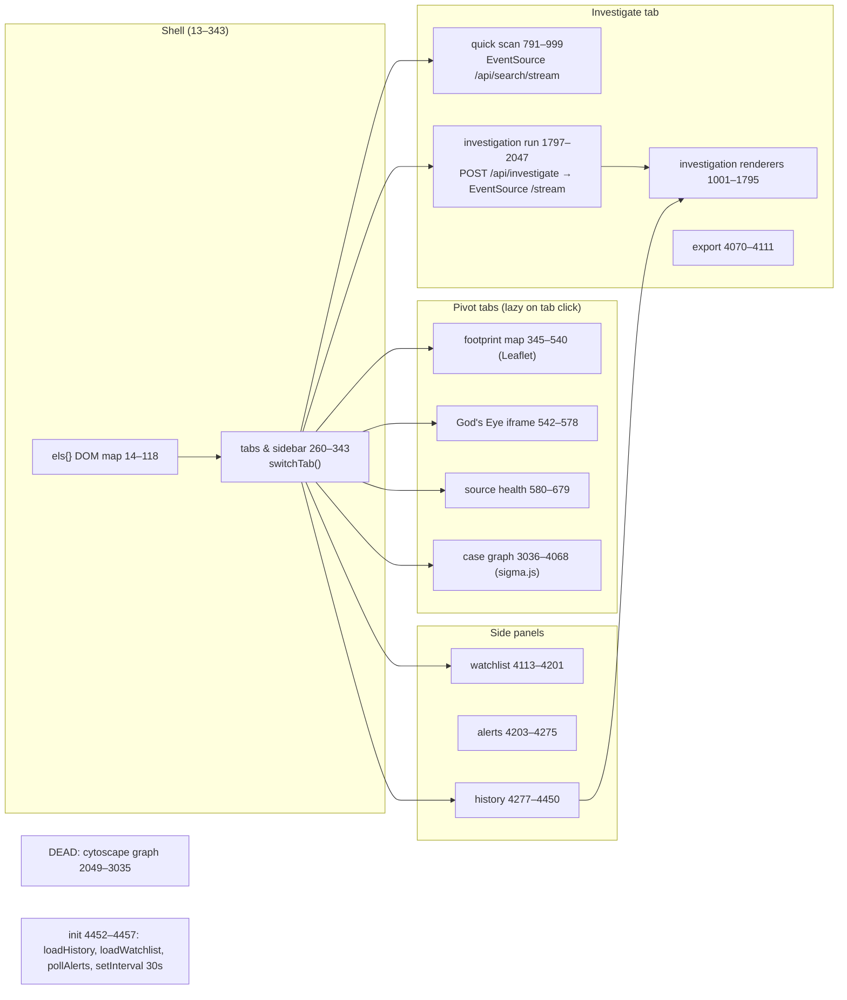

<!-- Read-only audit produced 2026-09-06 against commit 32c061f. Line numbers refer to that commit. -->
# sherlock-web — Frontend architecture map (code-verified)

Scope: `static/index.html` (596 lines), `static/js/app.js` (4457 lines, one IIFE, `"use strict"`, `node --check` passes), `static/css/app.css` (10,169 lines / 350 KB), `static/sw.js`, `static/manifest.webmanifest`, `static/404.html`, `static/vendor/*`. Working tree == `32c061f` (only `.superdesign/` untracked, not served). Every claim cites `path:line`. Method: grep/AST-free scripts + full read of app.js; backend keys checked against `app.py`, `recon/pipeline.py`, `recon/router.py`, `recon/graph.py`, `recon/geo.py`, `recon/breach.py`, `recon/brokers.py`, `recon/enrich.py`, `recon/email_pivot.py`, `recon/phone_pivot.py`, `recon/domain_pivot.py`, `recon/correlate.py`, `recon/adapters.py`. No server started, no network.

Headline findings (details in §9):
1. The entire Cytoscape "identity graph" workbench (`app.js:2049–3035`, ~985 lines), its `#graphPanel` DOM (`index.html:278–362`) and five vendor bundles (~730 KB) are **unreachable**: `renderGraph` has no caller (`app.js:2439` declaration only; `graphBtn` now does `switchTab("casegraph")` at `app.js:3031–3034`).
2. `function download` is declared twice at IIFE scope with swapped parameter order (`app.js:2906` vs `app.js:4071`); the later hoists over the earlier, so the (dead) graph CSV/GraphML exports at `2937`/`2981` would write the MIME string as file body.
3. `static/vendor/graphology-library.min.js` (168 KB) is vendored but referenced by neither `index.html` nor `app.js`.
4. All 36 `innerHTML` sinks are static templates, `= ""` clears, or `esc()`-wrapped — except `app.js:1621` which interpolates `d.drop_portal` unescaped into an `href` (backend constant, `recon/brokers.py:49`). No `href`/`src` sink applies a URL-scheme allowlist; target-controlled image URLs reach `img.src`/`background-image` (OPSEC: investigator IP leaks to profile hosts).

---

## 1. Structure of `app.js` (file order)

| # | Section (banner) | Lines | Entry points | Owns DOM ids / classes |
|---|---|---|---|---|
| 1 | header comment | 1–11 | — | claims section list "state · dom · utils … graph export watchlist alerts history init" and "API contract unchanged" (`1–9`) — stale, see §9 |
| 2 | dom | 13–118 | `els` map: 105 `getElementById` | every id in the Investigate tab + topbar + modal/toast (`14–118`) |
| 3 | state | 120–151 | globals (§4); `EMPTY_STATE_HTML` (`136–151`) | `.empty-state .hero .cap-grid .cap-card` |
| 4 | utils | 153–223 | `normSite` 154, `relTime` 158, `fmtElapsed` 173, `startElapsed/stopElapsed` 179/188, `bumpFound` 193, `setStatus` 198, `showSkeletons/removeSkeletons` 205/221 | `#statusPill .online/.offline`, `#statusPillText`, `#elapsedTime`, `#runFound`, `.skel-card .skel-line` |
| 5 | toasts & modal | 225–258 | `toast` 226, `confirmModal` 238, `closeModal` 246 | `#toastWrap .toast.(info|success|error) .leaving`, `#modalWrap #modalTitle #modalBody #modalConfirm #modalCancel` |
| 6 | tabs & sidebar | 260–343 | `tabEls` 261, `SECTION_META` 272, `setSectionMeta` 283, `closeSidebar` 303, `.app-tab` click 318–339, `switchTab` 341 | `#tabInvestigate #tabWatchlist #tabHistory #tabHealth #tabCasegraph #tabFootprint #tabGodseye`, `.app-tab[data-tab]`, `#sectionTitle #sectionSub #brandHome #copyYear #menuBtn #sidebar.open #sidebarOverlay.open`; sets `document.title` (`290`) |
| 7 | subject footprint map (Leaflet) | 345–540 | `openFootprint` 360, `fpRender` 378, `fpEsc` 428, `fpFit` 433, `fpRenderVerdict` 441, `fpRenderList` 455, CSV IIFE 517–540 | `#fpMap #fpEmpty #fpVerdict #fpAssessment #fpList #fpFitBtn #fpCsvBtn`, `.fp-item .fp-dot .fp-group-title .fp-unresolved .fp-pop-kind .fp-dark-tiles` |
| 8 | God's Eye (iframe) | 542–578 | `openGodseye` 546; recheck IIFE 574–577 | `#gevFrame #gevSetup #gevStatus(.down) #gevUrl #gevOpen #gevRecheck` |
| 9 | adaptive routing / source health | 580–679 | `ERROR_LABELS` 581, `breakdownText` 588, `degradedText` 599, `noteSkippedDegraded` 604, `loadHealthSources` 610; global Escape handler 661–679 | `#healthSummary #healthList .hrow .site .engine .badge.circuit-(open|half|closed) .cls .meta` |
| 10 | site picker | 680–745 | `updatePickerLabel` 681, `renderSiteList` 686, `/api/sites` fetch 737 | `#sitePickerBtn #sitePickerLabel #sitePicker.open #siteFilter #siteList .site-item .nsfw-tag #selectAllFiltered #clearSites` |
| 11 | mode sub-tabs | 746–762 | `tabQuick`/`tabInv` click | `#tabQuick #tabInv .mode-tab.active`, `#quickForm #invForm` (inline `style.display`) |
| 12 | shared result helpers | 764–789 | `clearResults` 765, `resetInvestigationUI` 783 | `#results #exportBar #rerunBtn #dossierBtn #graphBtn #watchBtn #graphPanel #overallBar #overallFill` |
| 13 | quick-scan cards | 791–876 | `getCard` 792, `addFoundRow` 822, `addErrorRow` 849, `updateOverall` 870 | `.user-card .user-head .badge.(scanning|found|err) .mini-progress .progress-fill .result-rows .rrow(.error) .site .qt .status`, `#overallText` |
| 14 | quick scan (SSE consumer) | 878–999 | `setRunning` 879, `stopStream` 886, start click 899–998 | `#startBtn #stopBtn #usernames #timeout #nsfw`, `#overallBar.is-running` |
| 15 | investigation renderers | 1001–1795 | `sectionKeyFor` 1002, `invSection` 1008, `sectionFor` 1045, `engineBadges` 1057, `addInvFoundRow` 1067, `mergeInvRow` 1118, `VERIFY_LABELS` 1126, `rowConfFromStatus` 1139, `shortDate` 1148, `applyRowConfidence` 1165, `applyRowUnknownConfidence` 1184, `finalizeAccuracy` 1201, `setVerifyBadge` 1220, `enrichInvRow` 1239, `addInvErrorRow` 1301, `renderGravatar` 1314, `addHoleheRow` 1373, `phoneSubhead` 1414, `ensurePhoneAccounts` 1424, `phoneAccountRow` 1441, `addPhoneAccountRow` 1458, `renderPhoneIntel` 1465, `renderDomainIntel` 1565, `BROKER_STATUS` 1604, `renderBrokerExposure` 1611, `renderBreachExposure` 1660, `esc` 1727, breach click 1731–1753, `renderCorrelation` 1754 | `.section-head .section-caveat .badge.hits .dim .rmain .badges .engine-badge.<engine> .variant-tag .row-conf.(conf-high|conf-med|conf-low|conf-none) .verify-badge.(confirmed|unconfirmed|false|indeterminate|unverified) .fp .row-temporal .enrich .e-name .e-bio .grav-field .e-subject-email .email-hit .email-miss .recovery-hint .trail-badge .phone-subhead .phone-accounts .phone-grid .phone-valid .phone-invalid .phone-links-block .brow .brow-links .phone-links .phone-link-<kind> .badge.b-(listed|blocked|none|manual) .cluster-card .conf-track .conf-fill .rationale`, `#breachBtn` |
| 16 | investigation run | 1797–2047 | `setInvRunning` 1798, `stopInvestigation` 1805, `enableInvestigationActions` 1818, `startRerun` 1831, start click 1853–1901, `openInvestigationStream` 1903, rerun/dossier/watch clicks 2012–2047 | `#invStartBtn #invStopBtn #invName #invUsernames #invEmail #invPhone #invDomain #invLocation #invVariants #invThorough #invTimeout #invNsfw #watchInterval` |
| 17 | identity graph (cytoscape) — **DEAD** | 2049–2678 | `typeGroup` 2069, `ageBand` 2079, `confidenceBand` 2097, `nodeColor` 2103 (live: reused by case graph), `nodeSize` 2117 (live: reused), `nodeVisible` 2127, `applyGraphFilters` 2152, timeline 2177–2226, chips 2229–2238, PNG 2241–2251, search 2254–2308, `zoomGraph` 2310, `showNodePanel` 2331, `renderGraph` 2439 (**no caller**), `highlightPath` 2658 | `#cy #cyNav #graphWrap #graphFocusChip .fc-label #graphFocusClose #graphHelp #graphFallback #graphToolbar … #nodePanel #nodePanelBody #nodePanelClose #timelineBar #tlPlayBtn #tlScrub #tlDate #confSlider #nodeConfSlider .gchip[data-gtype]`; cytoscape element classes `hl dimmed srch-out is-new gone-node noted aged g-*` |
| 18 | workbench (notes/ctx-menu/ego/cluster/exports/shortcuts) — mostly DEAD | 2680–3035 | `notesKey/loadNotes/saveNote` 2691–2710 (**live**: used by case graph 3727, 3779), `showGraphCtx` 2716, `pivotToForm` 2769 (dead), `focusEgo/exitEgo` 2779/2791, `setCluster` 2800, `runLayout` 2826, `nodeVisible` monkey-patch 2862–2870, `updateGraphStats` 2873, `initNavigator` 2896, `download` 2906, `csvCell` 2916, GraphML 2941–2983, fullscreen 2986, help 2994, keyboard 2999–3029, **`graphBtn` → `switchTab("casegraph")` 3031–3034** | `#graphCtx .gctx`, `#graphPanel.fs` |
| 19 | case graph (WebGL, sigma.js) | 3036–4068 | `cgEls` 3045, `CG_TIER` 3084, `cgNodeColor/Size` 3093/3099, `cgNodeHidden` 3108 (single visibility predicate), `cgLibs` 3125, `cgShow` 3134, `openCaseGraph` 3141, `cgLayout` 3161 (BFS + tier rings), `cgRender` 3220, `cgToggleTier` 3344, `cgFitVisible` 3353, cards 3374–3480, hulls 3484–3572, `cgUpdateTriage` 3574, `cgInspect` 3617, resize/Escape 3792–3806, search 3809–3842, fit/reset 3844–3855, CSV 3857–3887, ego 3890–3923, timeline 3926–3986, changes 3989–3994, PNG 3997–4016, GraphML 4019–4068 | `#cgStage #cgCanvas #cgEmpty #cgFallback #cgInspector #cgTriage #cgCards #cgHulls #cgSearch #cgFitBtn #cgResetBtn #cgCsvBtn #cgPngBtn #cgGraphmlBtn #cgChangesBtn #cgTimeline #cgTlPlay #cgTlScrub #cgTlDate`, `.cg-card(.sel) .cg-card-av .cg-card-main .cg-card-handle .cg-card-pip .cg-card-site .cg-card-bar .cg-tier-chip.(on|off) .cg-tier-dot .cg-triage-hint .cg-triage-diff .cg-insp-* .cg-tier-badge .is-muted .btn.btn-ghost.btn-sm` |
| 20 | export | 4070–4111 | `download` 4071 (wins hoisting), CSV 4080–4097, JSON 4099–4103, clear 4105–4111 | `#csvBtn #jsonBtn #clearBtn` |
| 21 | watchlist | 4113–4201 | `loadWatchlist` 4114, create click 4172–4201 | `#watchList .watch-item(.enabled) .w-label .w-toggle.(on|off) .w-meta .w-actions .w-del`, `#watchLabel #watchName #watchUsernames #watchEmail #watchNewInterval #watchCreateBtn` |
| 22 | alerts | 4203–4275 | `KIND_ICONS` 4204, `renderAlertItem` 4209, `pollAlerts` 4227, `loadAllAlerts` 4247, bell 4257–4275 | `#alertBadge #alertsList #allAlertsList #alertsDrop.open #bellBtn #markSeenBtn .alert-item.(seen|unseen) .a-kind.<kind> .a-time` |
| 23 | history | 4277–4450 | `loadHistory` 4278, `renderSummaryReadOnly` 4352, `loadRun` 4393 | `#historyPage .hist-item[tabindex=0] .h-user .h-kind .h-meta .h-found .h-actions` |
| 24 | init | 4452–4457 | `loadHistory(); loadWatchlist(); pollAlerts(); setInterval(pollAlerts, 30000)` | — |

Service worker: there is **no registration** anywhere in `app.js` (grep `serviceWorker` → 0 hits). `index.html:579–593` inline script *unregisters* all workers and deletes all caches; `sw.js` is a self-destructing kill-switch (`sw.js:14–28`, no `fetch` handler `sw.js:30`).

---

## 2. Backend contract — every `fetch(` / `new EventSource(`

Routes verified against `app.py` decorators (`app.py:225–1533`; routes `557–1455` are inside `if RECON_AVAILABLE:` at `app.py:507`, with an `else:` at `1456` that only defines `/api/recon/stream`). **All 22 client call sites resolve to a live route**; response keys read by the JS were checked against the backend return values.

| # | app.js | Method + path | Backend route | Response keys read by JS | Verified? |
|---|---|---|---|---|---|
| 1 | 364 | GET `/api/investigate/{id}/footprint` | `app.py:1271` → `recon/geo.py:357` | `error`; `points[]{kind,lat,lon,site,label,display,org,country}`, `stats{consistency,assessment,max_spread_km}`, `unresolved[]{label,place,ip,reason}` | ✅ `geo.py:107,112–113,218–220,264–267,306–310,346–351,357–358` |
| 2 | 561 | GET `/api/godseye/status` | `app.py:1513` | `url`, `reachable` | ✅ `app.py:1515–1516` |
| 3 | 613 | GET `/api/health/sources` | `app.py:279` → `recon/router.py` `sources_summary` | `available`, `aggregate{sites_tracked,observations,overall_failure_rate,circuits_open}`, `sites[]{site,engine,circuit,cooldown_remaining_s,dominant_error,failure_rate,observations,ewma_latency_ms}` | ✅ router.py summary return (rel. lines 30–54 of `sources_summary`) |
| 4 | 737 | GET `/api/sites` | `app.py:267` | `[]{name,nsfw}` | ✅ `app.py:269–272` |
| 5 | 915 | **EventSource** GET `/api/search/stream?usernames&timeout&nsfw&sites` | `app.py:429` | see §3 | ✅ |
| 6 | 1736 | GET `/api/investigate/{id}/breach` | `app.py:1253` → `recon/breach.py:159–178` | `error`; `checked`, `note`, `compromised_count`, `identifiers_checked`, `source`, `results[]{identifier,kind,compromised,infections,last_compromise,stealers[]{date_compromised,operating_system,computer_name,user_services,corporate_services}}` | ✅ `breach.py:61–67,86–90,117–118,164–177` |
| 7 | 1834 | POST `/api/investigate/{id}/rerun` | `app.py:1020` | `error`, `investigation_id`, `inputs{name,usernames,email}` | ✅ `app.py:1039–1040` |
| 8 | 1875 | POST `/api/investigate` (JSON body) | `app.py:961` | `error`, `investigation_id` | ✅ `app.py:1011` |
| 9 | 1906 | **EventSource** GET `/api/investigate/{id}/stream?nsfw` | `app.py:1042` | see §3 | ✅ |
| 10 | 2033 | POST `/api/watchlist` (from results bar) | `app.py:1356` | `error`, `label` | ✅ `app.py:1389–1390` |
| 11 | 3144 | GET `/api/investigate/{id}/graph` | `app.py:1126` → `recon/graph.py:86–393` | `error`; `nodes[]{id,type,label,sublabel,url,avatar,confidence,engines,verification,tier,cluster,created_at,data{site,url,source,verification,category,is_new,gone}}`, `edges[]{id,source,target,confidence,rationale,kind,evidence{avatar_distance,name_sim,bio_overlap,name_conflict,ignored}}` | ✅ `graph.py:107–114,146–161,214,221–231,376,391,393`; evidence keys from `correlate.py:526–570` |
| 12 | 4115 | GET `/api/watchlist` | `app.py:1338` | `[]{id,label,enabled,inputs{name,usernames,email},interval_hours,last_run_at,alerts}` | ✅ `app.py:1349–1354` |
| 13 | 4132 | POST `/api/watchlist/{id}/toggle` | `app.py:1392` | (none — reloads list) | ✅ |
| 14 | 4160 | DELETE `/api/watchlist/{id}` | `app.py:1405` | (none) | ✅ |
| 15 | 4186 | POST `/api/watchlist` (watchlist page) | `app.py:1356` | `error` | ✅ |
| 16 | 4228 | GET `/api/alerts?unseen=1` | `app.py:1416` | `[]{kind,message,seen,created_at,watch_label}`; `.length` | ✅ `app.py:1430–1434` |
| 17 | 4248 | GET `/api/alerts` | `app.py:1416` | same | ✅ |
| 18 | 4270 | POST `/api/alerts/mark_seen` body `{}` | `app.py:1435` | (none) | ✅ (`ids` absent → marks all, `app.py:1451`) |
| 19 | 4279 | GET `/api/history` | `app.py:225` | `[]{id,ts,username,found,total,kind,investigation_id}` | ✅ `app.py:233–236` |
| 20 | 4394 | GET `/api/history/{id}` | `app.py:239` | `error`, `kind`, `results` (list for quick scan; dict summary for investigation/recon), `investigation_id`, `username`, `ts` | ✅ `app.py:249–261` |
| 21 | 4412 | GET `/api/investigate/{id}` (id may be `0` when null) | `app.py:1013` → `_get_investigation` `app.py:930–944` | `error`, `id` | ✅ (404 JSON `{"error":"not found"}` handled at `4415`) |
| — | 2018, 4319 | `window.open` / `<a href>` `/api/investigate/{id}/report` | `app.py:1314` (HTML) | — | ✅ |
| — | 566 | `iframe.src = s.url` (God's Eye) | external service (`GODSEYE_URL`) | — | n/a |

Keys read but **not sent** (harmless fallbacks): `d.temporal.last_activity` / `last_post` (`app.js:1249`) — adapters emit only `created_at`, `indexed_at`, `last_profile_update` (`recon/adapters.py:167,180,193–243`).

Backend routes with **no frontend caller**: `/api/recon/stream` (`app.py:557`, `1458`), `/api/recon/report/{run_id}` (`853`), `/api/domain` (`906`), `/api/brokers` (`917`), `/api/investigate/{id}/exposure` (`1242`), `/timeline` (`1289`), `/connections` (`1301`). `/manifest.webmanifest` (`1476`) is linked from `index.html:8`; `/sw.js` (`1483`) is served but never registered.

Auth: `basic_auth_gate` middleware (`app.py:120–138`) applies to every path incl. SSE; `EventSource` cannot set headers, so it relies on browser-cached Basic credentials (not runtime-verified).

---

## 3. SSE event handling

### Quick scan — `es` (`app.js:915–998`) vs emitters `app.py`

| Event | Client handler | Client reads | Emitter | Match |
|---|---|---|---|---|
| `meta` | 918 → totals, `updateOverall` | `usernames[]`, `sites_total` | `app.py:468–474` | ✅ |
| `user_start` | 926 → card "scanning" | `username` | `app.py:361` (`_emit_ts`) | ✅ |
| `found` | 934 → `addFoundRow`, show export bar | `username,site,url,query_time` | `QueueNotify._emit` `app.py:310–330` | ✅ |
| `error` | 940 → `addErrorRow` | `username,site,status,context` | `app.py:333–341` | ✅ |
| `progress` | 945 → fill bar | `username,checked,total` | `app.py:373` | ✅ |
| `user_done` | 954 → "done", `loadHistory()` | `username` | `app.py:414–416` | ✅ |
| `fatal` | 964 → toast, `stopStream` | `message` | `app.py:420`, `441` | ✅ |
| `skipped_degraded` | 970 → toast | `count`, `sites[]{site}` | `recon/router.py:582–585` via `announce_skipped` (`app.py:353`) | ✅ |
| `retry` | 974 → "retrying…" | `username` | `app.py:392` (`_emit_ts("retry", rec)`), rec = `{engine,site,username,class}` `router.py:606–609` | ✅ |
| `done` | 981 → message, close, `loadHistory` | `error_breakdown`, `degraded_sources` (via `breakdownText/degradedText`) | `app.py:424` `{"runs", **router.breakdown()}`; `router.py:655–659` | ✅ (`runs` unused) |
| `onerror` | 994 → `setRunning(false)` only if CLOSED | — | — | — |

### Investigation — `invEs` (`app.js:1906–2010`) vs `recon/pipeline.py` + `app.py:1042–1125`

| Event | Client | Client reads | Emitter | Match |
|---|---|---|---|---|
| `meta` | 1910 | `sherlock_sites, maigret_sites, whatsmyname_sites, candidates, candidate_sites, email, phone, domain` | `pipeline.py:525–531` | ✅ |
| `candidates` | 1922 → section note | `name, candidates[]` | `pipeline.py:535` | ✅ |
| `found` | 1927 → `addInvFoundRow` | `username,site,url,engines,source,variant_of,from_name,candidate` | `pipeline.py:222–232` | ✅ |
| `merged` | 1928 → `mergeInvRow` | `username,site,engines` | `pipeline.py:211–219` | ✅ |
| `error` | 1929 → `addInvErrorRow` | `engine,site,status,context,source,…` | `pipeline.py:235–241` | ✅ |
| `progress` | 1930 → note | `engine,checked,total` + section key | `pipeline.py:244–250` | ✅ |
| `engine_done` | 1935 → status "scanning" | section key fields | `pipeline.py:266–271` | ✅ |
| `engine_error` | 1940 → toast | `engine,message` | `pipeline.py:273` | ✅ |
| `phase` | 1944 → "Enriching up to N" | `phase,targets` | `pipeline.py:625–626` | ✅ |
| `enriched` | 1949 → `enrichInvRow` | `username,site,verification{status,signals},confidence,temporal{…},enrichment{jsonld_image,og_image,jsonld_name,og_title,title,jsonld_description,og_description}` | `pipeline.py:629–640`; `enrich.py:80–113` (rel.); `verify.py:210` | ✅ |
| `email` | 1950 → gravatar / holehe | `source,email,profile{avatar_url,display_name,full_name,about,profile_url,accounts[]{name,domain,url}}`; holehe `site,exists,error,rate_limit,domain,email_recovery,phone_number,corroborates_phone` | `pipeline.py:447–462`; `email_pivot.py:71–86,141–155`; `corroborates_phone` `email_pivot.py:50` | ✅ |
| `phone_intel` | 1955 → `renderPhoneIntel` | `valid,possible,e164,international,country,region,assumed_region,location,carrier,line_type,timezones,note,error,accounts,reverse_lookup,footprint` | `pipeline.py:541–546`; `phone_pivot.py:81–218`; `brokers.py:99,134,146` | ✅ |
| `phone_account` | 1958 | `exists,error,site,domain,rate_limit` | `pipeline.py:487–491` | ✅ |
| `domain_intel` | 1961 | `domain,dns{A,AAAA,MX,NS,TXT},rdap{registrar,registered,expires,nameservers},subdomains,subdomain_count,error` | `pipeline.py:471`; `domain_pivot.py:113–118,195,208–215` | ✅ |
| `broker_exposure` | 1964 | `brokers[]{name,category,status,search_url,optout_url}, name, summary{total,listed,blocked}, drop_portal` | `pipeline.py:477`; `brokers.py:201–226` | ✅ |
| `correlation` | 1967 | `clusters[]{confidence,members[]{site,url},links[]{rationale}}` | `pipeline.py:646`; `correlate.py:639–655` | ✅ |
| `saved` | 1970 → `enableInvestigationActions` | `investigation_id` | `app.py:1091–1092` | ✅ |
| `fatal` | 1974 | `message` | `pipeline`/`app.py:1095`, `1049` | ✅ |
| `skipped_degraded` | 1978 | `count,sites` | `router.py:582` via `pipeline.py:523` | ✅ |
| `retry` | 1981 → `sectionKeyFor(d)` | needs `source`/`variant_of`/`username` | payload is `{engine,site,username,class}` (`router.py:606–609`) — **no `source`/`variant_of`** → key falls to `base:<username>`; variant/name cards never show "retrying…" | ⚠️ partial |
| `done` | 1986 → `finalizeAccuracy`, summary text, close, `loadHistory` | `found,leads,flagged,not_examined,indeterminate,hits,clusters,email_hits,error_breakdown,degraded_sources` | `pipeline.py:679–697` + `router.breakdown()` | ✅ |
| `onerror` | 2008 | — | — | — |

**Emitted but never listened for**: `meta_run` (`app.py:1102`), `engine_start` (`pipeline.py:258`), `variants_planned` (`605`), `email_done` (`464`), `phone_account_done` (`494`). No client listener lacks an emitter.

Protocol risk (not runtime-verified): the server ends the stream by returning (`app.py:1114–1116`); if the client has not received `done`/`fatal` (both call `close()` at `2004`/`1976`, `990`/`967`), `EventSource` auto-reconnects and `/stream` unconditionally restarts `run_pipeline` (`app.py:1052–1099`). No `Last-Event-ID` handling.

---

## 4. State model

Module-level state (all `var` inside the IIFE):

| Concern | Variables (`app.js`) |
|---|---|
| Sites / picker | `allSites` 121, `selectedSites` 122 |
| Current run/export | `currentRun[]` 123, `foundTotal` 134, `runStartedAt` 132, `elapsedTimer` 133 |
| Streams | `es` 124 (quick), `invEs` 125 (investigation) |
| Result DOM registries | `cards{}` 126 (username→refs), `invRows{}` 127 (`username|normsite`→{el,badgesEl,data}), `invCards{}` 128 (section key→refs), `holeheCounts` 131 |
| Investigation identity | `currentInvId` 129, `currentInvInputs` 130 — set by `enableInvestigationActions` 1818 from `saved`/`done`/history load; cleared by `clearResults` 765 |
| Quick-scan progress | `totalUsers, doneUsers, totalSitesPerUser, checkedCurrent` 869 |
| Modal | `modalOnConfirm` 237 |
| Footprint | `fpMap, fpLayer, fpData, fpMarkers` 351; `FP_KIND` 352 |
| God's Eye | `gevFrameUrl` 545 |
| Dead cytoscape | `cy, graphData, graphLabelsOn, fcoseRegistered, selNode` 2050–2054; `tlState` 2095; `typeVis` 2125; `searchTimer` 2254; `dismissedIds, changesOnly, clusterMode` 2682–2684; `navigatorReady` 2895 |
| Case graph | `cgSigma, cgData` 3043–3044; `cgEls` 3045; `cgChangesOnly, cgEgoSet, cgTl, cgDepth` 3066–3069; `cgNodeById, cgCardPool, cgSelectedId` 3073–3075; `cgTierVis` 3091 |
| Constants | `EMPTY_STATE_HTML` 136, `SECTION_META` 272, `ERROR_LABELS` 581, `VERIFY_LABELS` 1126, `BROKER_STATUS` 1604, `NODE_COLORS` 2056, `AGE_STYLE` 2088, `CG_TIER` 3084, `CG_TIER_ORDER` 3090, `CG_TIER_RADIUS` 3159, `CG_CARD_*` 3076–3077, `KIND_ICONS` 4204 |

Tab switching: `.app-tab[data-tab]` click handler (`318–339`) toggles `.active` on the seven `<main>` panels (`tabEls` 261–269) and `aria-selected`; CSS hides non-active panels (`app.css:452` `main{display:none}`, `453` `main.active{display:flex}`, `454` `main.page.active{display:block}`, restated at `8786–8799`). Each tab lazily loads on click: watchlist→`loadWatchlist+loadAllAlerts`, history→`loadHistory`, health→`loadHealthSources`, casegraph→`openCaseGraph`, footprint→`openFootprint`, godseye→`openGodseye` (`331–336`). `switchTab(tab)` (`341–343`) is a programmatic `.click()`. Investigate sub-modes toggle `#quickForm`/`#invForm` via inline `style.display` (`747–762`). Topbar title + `document.title` follow the tab (`283–291`).

Persistence:
- `localStorage`: single key family `sop.notes.<investigationId|none>` → JSON `{nodeId: text}` (`2691–2700`), read by dead node panel (`2417`) and live inspector (`3727`, `3779`); wrapped in try/catch.
- `sessionStorage` / IndexedDB: none. Cookies: none.
- Service-worker caches: actively deleted (`index.html:587–591`, `sw.js:19–20`).
- Everything else is server-side SQLite via the API (history, watchlist, alerts, investigations).
- Session-only memory: `dismissedIds` (dead), `cgTierVis` reset per render (`3229`).

---

## 5. Rendering hot paths & risks

Escaping helpers: `esc(s)` `app.js:1727–1730` and `fpEsc(s)` `428–431` are byte-identical (`& < >` only — **not** `"`/`'`, so unsafe for attribute contexts; currently only used in text contexts). Two further local `esc` closures for GraphML add `&quot;` (`2954–2958`, `4020–4024`). Dominant pattern is `createElement` + `textContent` (178 / 170 uses vs 36 `innerHTML`).

### All 36 `innerHTML` sinks, classified

| Line | Classification | Note |
|---|---|---|
| 212 | static | skeleton template |
| 458, 616, 628, 688, 766, 1058, 1570, 1616, 1664, 2336†, 2747†, 3377, 3586, 3789, 4120, 4240, 4253, 4284 | clear (`= ""`) | — |
| 625, 1759, 3304, 4117, 4237, 4250, 4281, 4445 | static | literal hint/empty-state strings |
| 637 | static template, data via `textContent` | `circuitCls` is one of three literals (`632–633`) |
| 797, 1026 | static template, data via `textContent` (`807`, `1032`) | — |
| 1621 | **unescaped** | `(s.total||0)`, `(s.listed||0)`, `(s.blocked||0)` numbers + `d.drop_portal` raw in `href="…"`. Source: backend constant `recon/brokers.py:49,219` (also persisted in `summary.brokers` and replayed from DB on reload `4373`). Trusted origin, but the only sink that interpolates server data without `esc()` and into an attribute. |
| 1669 | escaped | `esc(d.note)`; `d.note` is a backend literal (`breach.py:166`) |
| 1715 | escaped | `esc(bits.join(" · "))`, bits from Hudson Rock API (remote) |
| 2196†, 3954 | static | `&#10074;&#10074;` / `&#9654;` |
| 4110 | static | `EMPTY_STATE_HTML` constant |

† = dead code path. Other HTML sinks: Leaflet `bindPopup(html)` (`401–405`) — all interpolations `fpEsc()`-wrapped (text context). No `outerHTML`, `insertAdjacentHTML`, `document.write`, `DOMParser`.

### URL / resource sinks (no scheme allowlist anywhere; only `1478` checks `indexOf("http")===0`, and only to decide `target=_blank`)

| Sink | Lines | Data origin | Risk |
|---|---|---|---|
| `a.href = <url>` + `target=_blank rel=noopener noreferrer` | 830, 1091, 1354, 1361, 1531, 1536, 1556, 1645, 1649, 1781, 3653, 3764 (dead: 2373) | engine site templates (`found.url`), Gravatar API (`profile_url`, `accounts[].url`), backend brokers/footprint-lead URLs, correlation member URLs, graph node URLs | `javascript:` would execute on click if a source ever supplied one; sources are semi-trusted data files + Gravatar. |
| `mailto:`/`tel:` | 1322, 1477 | user input | fine |
| `img.src` | 1281 (`jsonld_image`/`og_image` scraped from target's profile page), 1338 (Gravatar thumbnail), dead 2339 | **target-controlled** | OPSEC: the investigator's browser fetches from the subject's chosen host (IP/UA leak). `loading="lazy"` only on 1281. |
| CSS `background-image: url("…")` | 3399 (`node.avatar` from `graph.py:148 _avatar(row)`); dead cytoscape `data(avatar)` 2540 | target-controlled | same OPSEC leak; CSSOM single-property setter — `"`/`)` in URL invalidates the value, no property injection |
| `iframe.src` | 566 | `GODSEYE_URL` (server config) | iframe has `referrerpolicy="no-referrer"`, `allow="microphone; xr-spatial-tracking; fullscreen"`, **no `sandbox`** (`index.html:525–527`) |
| Leaflet tiles | 395 | `https://tile.openstreetmap.org` | third-party request per view |
| Google Fonts | `index.html:12–14` | third-party CSS+font on every page load | fingerprint/IP leak to Google; no CSP meta at all (`index.html:4–9`) |
| `window.open(d.url)` | 2018 (same-origin report), 2721 (dead) | — | — |

### Long synchronous loops / hot paths

| Where | What | Cost |
|---|---|---|
| `renderSiteList` 686–708 on `#siteFilter` `input` 726 | rebuilds every site row (~all sites from `/api/sites`) per keystroke, no debounce | O(sites) DOM per key |
| `finalizeAccuracy` 1201–1218 | for every card: `querySelectorAll(".rrow")`, sort by `dataset.conf`, re-`appendChild` each row | O(rows log rows) reflow on `done` and on every history load |
| `cgSyncOverlays` 3481 bound to sigma `afterRender` 3309 | `cgSyncHulls` 3513 + `cgSyncCards` 3435: each `g.forEachNode` + `graphToViewport` per node, hull canvas realloc on size change, card pool capped at 44 (`3077`) | O(N) per rendered frame; during timeline play (rAF, 12 s, `3962–3986`) `cgSigma.refresh()` each frame |
| `nodeReducer` 3313–3322 / `edgeReducer` 3323–3331 | `cgNodeHidden` predicate per node per frame; `Object.assign({}, attrs, {hidden:true})` allocation for hidden nodes; `edgeReducer` calls `getGraph().extremities(edge)` per edge only in ego mode | per frame |
| `cgInspect` 3618–3621 | linear scan of `data.nodes` although `cgNodeById` exists (3073) | O(N) per click |
| `cgLayout` 3161–3218 | BFS + per-tier ring placement, once per render | O(N+E) |
| `loadHistory()` | refetched on every quick-scan `user_done` (958) and both `done`s (990, 2005) | extra GETs mid-scan |
| `pollAlerts` | every 30 s (4456); also flips `#statusPill` online/offline (4230, 4243) | — |
| SSE handlers | `JSON.parse` + append per event; `addInvFoundRow` dedups by key (1070) | fine |

Sigma specifics: labels toggled via `setSetting("renderLabels", …)` only when changed (`3460–3463`); custom bbox for "fit visible" (`3353–3371`, `3890–3905`) inside try/catch for older sigma; `cgSigma.kill()` on re-render (`3232`); construction deferred with `setTimeout(…,0)` (`3285`) with a comment explaining why not rAF.

---

## 6. Vendor libraries (`static/vendor/`, all loaded as classic `<script>` globals; nothing from a CDN)

| File (size) | Package | Version | License | Global | `index.html` | Reachable? | Version evidence |
|---|---|---|---|---|---|---|---|
| `cytoscape.min.js` (374 KB) | cytoscape | 3.30.4 | MIT | `cytoscape` | 567 | **dead** (only `renderGraph`) | literal `3.30.4` in bundle; © Cytoscape Consortium header |
| `layout-base.js` (148 KB) | cytoscape-layout-base | 2.0.1 | MIT | `layoutBase` | 568 | dead | project-added header comment only |
| `cose-base.js` (119 KB) | cose-base | 2.2.0 | MIT | `coseBase` | 569 | dead | project-added header |
| `cytoscape-fcose.js` (57 KB) | cytoscape-fcose | 2.2.0 | MIT | `cytoscapeFcose` | 570 | dead (`cytoscape.use` at 2447) | project-added header |
| `cytoscape-navigator.css/.js` (0.8/29 KB) | cytoscape.js-navigator | 2.0.2 | MIT | `cy.navigator` | 571–572 | dead (`initNavigator` 2896) | version only in CSS header; JS has no version literal |
| `graphology.umd.min.js` (74 KB) | graphology | 0.25.4 (README) | MIT | `graphology` | 574 | live (`cgLibs` 3125) | **not verifiable** — no version literal in bundle |
| `sigma.min.js` (97 KB) | sigma | 2.4.0 (README) | MIT | `var Sigma` (constructor is `Sigma` or `Sigma.default`; handled 3128–3129) | 575 | live | **not verifiable** — no literal |
| `graphology-library.min.js` (168 KB) | graphology-library | 0.8.0 (README) | MIT | `graphologyLibrary` | **none** | **never loaded or referenced** | — |
| `leaflet.js/.css` (148/15 KB) | leaflet | 1.9.4 | BSD-2-Clause | `L` | 577–578 | live (`openFootprint` 361) | `@preserve Leaflet 1.9.4` header |

`README-webgl.md:1–22` documents sigma/graphology/graphology-library/leaflet and claims "no build step" UMD bundles; it does not document the cytoscape family. External at runtime: Google Fonts (`index.html:12–14`), OpenStreetMap tiles (`app.js:395`), God's Eye iframe origin (`GODSEYE_URL`, default `http://localhost:4173`, `index.html:538–542`).

---

## 7. IDs/classes the backend or tests depend on

- **`app.py`** references the frontend only by file path: `index.html` (`1472`), `manifest.webmanifest` (`1479`), `sw.js` (`1486`, headers `Service-Worker-Allowed: /`, `Cache-Control: no-cache`), `404.html` (`1527`), `StaticFiles` mount `/static` (`1533`). No element id/class strings.
- **`tests/`**: 27 recon unit-test modules; zero references to `static/`, `index.html`, `app.js`, ids or classes (only incidental `id="root"` in a stealthweb fixture, `tests/test_stealthweb.py:17`). **There is no frontend test coverage.**
- The "never rename" contract is therefore purely HTML↔JS: 148 distinct ids fetched by `getElementById` in `app.js`, all 148 exist in `index.html`; 11 HTML ids are unreferenced by JS (layout hooks for CSS): `bellWrap cgBody cgCockpit fpBody fpCockpit fpMap gevWrap graphToolbar resultsWrap sitePickerBtnLabel fpStage` (`fpMap` is passed to `L.map("fpMap")` by string at `386`; `sitePickerBtnLabel` is an `aria-labelledby` target `index.html:209–210`). Selector-based hooks: `.app-tab[data-tab]` (318), `.gchip[data-gtype]` (2230), `.fc-label` (2786), `#controls` (2773), `.skel-card` (222), `.rrow`/`.row-conf`/`.verify-badge`/`.rmain`/`.enrich`/`.phone-accounts`/`.phone-links-block`/`.user-head .dim` (`querySelector` targets in 1170–1235, 1427–1437).

---

## 8. Accessibility & responsiveness (verifiable from markup/CSS)

Markup (`index.html`): `lang="en"` (2), viewport meta (5), 145 `aria-*` attributes, 24 `role=` (tablist/tab/tabpanel on nav+panels `41–68,110–523`; `role="status"` on `#statusPill` 90; `role="menu"` on `#alertsDrop` 101 whose children are not `menuitem`s; `role="alertdialog" aria-modal aria-labelledby aria-describedby` on the modal 555; `role="complementary"` node panel 358), 2 `aria-live="polite"` regions — `#results` (365) and `#toastWrap` (565); every form control has a `for=`-paired `<label>` (24 labels), 59 `<button type="button">`, 8 headings, 0 `tabindex` in HTML (JS adds `tabindex="0"` + Enter/Space on history items `4287`, `4340–4342`), all inline SVGs `aria-hidden="true"`, JS-created `` get `alt=""` (1281, 1338). `aria-expanded`/`aria-pressed`/`aria-selected` are kept in sync by 25 `setAttribute` calls (`app.js:211–4266`). Modal moves focus to Confirm (`244`) but has no focus trap and `closeModal` (`246–249`) does not restore focus. Escape closes layers in priority order (`661–679`). The live `#results` region announces every streamed row (potential screen-reader flood).

CSS (`static/css/app.css`): media queries — `(hover:hover) and (pointer:fine)` ×27, `(max-width:860px)` ×13, `(prefers-contrast: more)` ×12, `(prefers-reduced-transparency: reduce)` ×7, `(max-width:560px)` ×7, `(max-width:1100px)` ×7, `(prefers-reduced-motion: reduce)` ×6 (first at 1368, kills `animation-name`), `(pointer:coarse)` ×3, `(max-width:900px)` ×2, `(max-width:700px)` ×2, `(max-width:640px|420px|1180px)`, `(min-width:1600px)`, `(min-width:700px) and (max-width:1100px)`, `(forced-colors: active)` ×1 (8690–8697: `Highlight`/`GrayText`), `print` ×1 (9040). Also `@container empty-state (min-width:880px)` (5348) and a `@supports not (backdrop-filter…)` fallback (2851). Focus: 41 `:focus-visible` rules, 63 `:focus`, 11 `outline:none|0` (mostly paired with a `box-shadow: var(--ring)` replacement, e.g. 8021; global `:focus:not(:focus-visible){outline:none}` 8294). Theme: `color-scheme: dark` only (2400) — no light theme, no `prefers-color-scheme`. Tokens: 221 custom properties; units 1,679 `px` vs 38 `rem`, 3 `clamp()`; 37 `!important`. `hidden` attribute is explicitly re-asserted where a class sets display (`679`, `1335`, `7865`, `9895`, `9935`, `10044`). Sidebar collapses to an overlay drawer via `#menuBtn` + `.sidebar.open` (`app.js:303–316`; CSS `1822`, `2257`).

---

## 9. Surprises

1. **Dead Cytoscape workbench.** `renderGraph` (`app.js:2439`) is never called (only mention is a comment at `2173`); `graphBtn` now switches to the WebGL tab (`3031–3034`). Consequences: ~985 lines (`2049–3035`), 43 ids in `#graphPanel` (`index.html:278–362`, always `display:none` `app.css:995`), five vendor bundles (~730 KB parsed on every load, `index.html:567–572`), CSS "BLOCK 10 graph-panel" (`app.css:5427–6155`) and 17b/17c (`9583–9807`) are unreachable. Still-live pieces from that region: `nodeColor` 2103, `nodeSize` 2117, `notesKey/loadNotes/saveNote` 2691–2710 (which also writes cytoscape classes when `cy` is null-safe at `2701`). The section comment at `3038–3042` says "the inline Cytoscape panel above is untouched".
2. **`download` shadowing bug (latent).** `function download(name, mime, content)` `2906` vs `function download(filename, text, mime)` `4071` in the same scope; the second wins. Dead callers `2937`, `2981` pass `(name, mime, content)`; live callers `4095`, `4101` match the winner.
3. **Unloaded vendor file**: `graphology-library.min.js` (168 KB) has no `<script>` tag and no reference in `app.js`.
4. **Duplicated helpers**: `esc` 1727 ≡ `fpEsc` 428; CSV quoting implemented 4× (`csvCell` 2916, local `cell` 521 and 3861, inline lambda 4088–4091); GraphML `esc` twice (2954, 4020); two timeline scrubbers (`tlState` 2095 vs `cgTl` 3068) and two `step` rAF loops (2216, 3976).
5. **Copy/branding drift**: `EMPTY_STATE_HTML` (`app.js:136–151`: "OSINT investigation console", "A full identity out.") ≠ the inline empty state in `index.html:365–398` ("Signals Ops console // v4", "Signal acquired.") — Clear swaps to the JS copy (`4110`). `manifest.webmanifest:2–4` says "Sherlock Web — OSINT username search across 400+ sites"; `<title>`/`404.html` say "Signals Ops"; exports are named `sherlock-results.*` (`4095`, `4101`) vs `signals-ops-graph.*`/`case-graph.*`/`subject-footprint.csv`.
6. **Stale header comment** `app.js:1–9` (section list omits footprint/godseye/health/casegraph; claims API contract unchanged from "original single-file app").
7. **Monkey-patching**: `nodeVisible` reassigned after declaration (`2862–2870`), `applyEdgeFilter` alias (`2174`), `evShifter` uses deprecated `window.event` (`2686–2688`) — all dead.
8. **Three competing `document` keydown Escape handlers** (`661`, `2999`, `3799`), order-dependent.
9. **SW/PWA residue**: `/sw.js` route + `Service-Worker-Allowed` header kept (`app.py:1483–1489`), manifest `display: standalone` (`manifest.webmanifest:7`), yet nothing registers a worker; `sw.js` self-destructs.
10. **Unconsumed/partial SSE events** (§3): `meta_run`, `engine_start`, `variants_planned`, `email_done`, `phone_account_done` unused; investigation `retry` lacks section-key fields.
11. **Unused backend surface** (§2): seven routes have no frontend caller.
12. **CSS layering**: 10,169 lines (1,366 comment, 577 blank, 8,226 code), 1,348 top-level rule blocks, **240 selectors defined more than once** (`::selection`×4, `.dropdown`×4, `#controls`×4, `textarea`×4, `:root`×3, `html/body/*`×3, `main{display:none}` at 452 and 8786, `.modal-wrap[hidden]` at 1335 and 7865, `.page-grid` at 1156 and 8874) — the stylesheet is built as "blocks" that restate earlier rules (acknowledged at `8705–8710`, `5133–5137`, `7295`).
13. `loadRun` requests `/api/investigate/0` when a run has no `investigation_id` (`4412`) — 404 JSON handled but wasteful.
14. `pollAlerts` doubles as the connectivity heartbeat: any alerts-endpoint failure flips the status pill to "offline" (`4243`).
15. `noteSkippedDegraded`'s toast type defaults to `"info"` (`605–607`); breach button is disabled/re-enabled on both paths (`1733`, `1740`, `1751`).
16. No TODO/FIXME markers anywhere in static files.

---

## 10. Not verified / out of scope

- Exact versions of `sigma.min.js`, `graphology.umd.min.js`, `graphology-library.min.js`, `cytoscape-navigator.js` (no version literals in the minified bundles; README/CSS-header claims only). `layout-base`/`cose-base`/`fcose` versions come from project-added header comments, not upstream banners.
- Runtime behaviour (server not started, no network): EventSource reconnect/re-run hypothesis in §3, Basic-auth interaction with `EventSource`, `frame-ancestors` of the God's Eye app, actual rendering of CSS blocks, sigma reducer performance at scale.
- Whether any engine site template or Gravatar response can carry a non-`http(s)` scheme (the client has no allowlist either way).
- `.superdesign/` (untracked) not inspected; not served by `app.py`.
